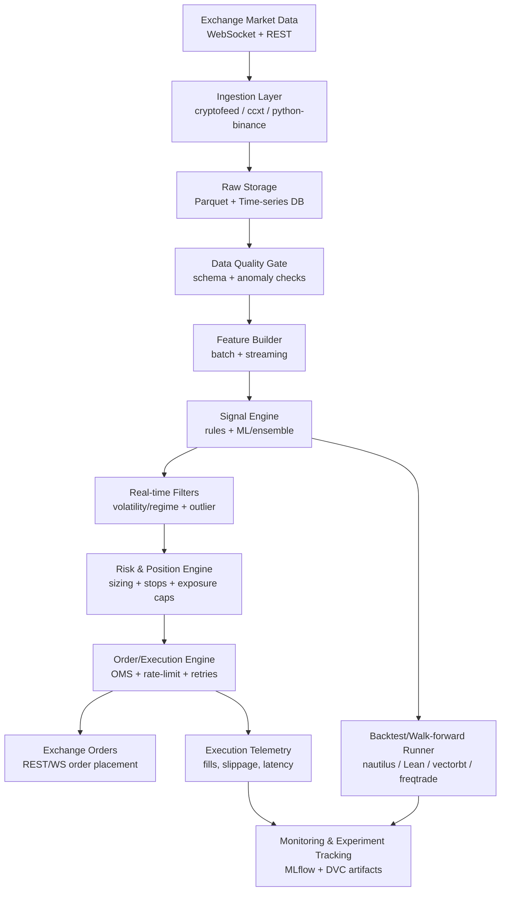
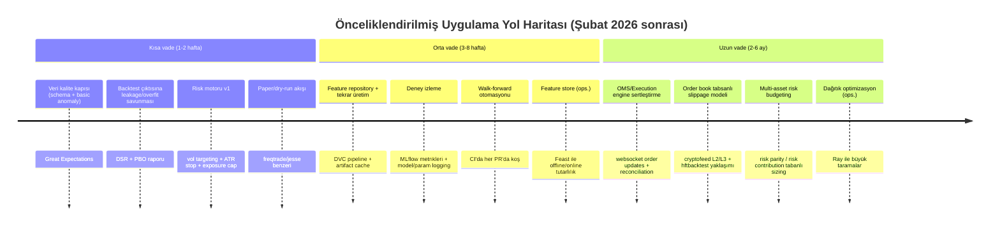

# Kripto Auto-Trade Botunuz İçin Sinyal Kalitesi ve Pozisyon Yönetimini Güçlendiren Açık Kaynak Ekosistem Raporu

## Yönetici Özeti

Mevcut bir kripto otomatik trade botunda “sinyal kalitesi” (signal generation/validation) ve “pozisyon yönetimi” (risk & sizing, stop/scale, execution) genellikle üç zayıf halkadan dolayı bozulur: (i) veri kalitesi ve gerçek-zamanlı filtreleme, (ii) hatalı değerlendirme (look-ahead/sızıntı, aşırı deneme → backtest overfitting), (iii) canlı icrada kayma (slippage), gecikme (latency) ve emir yaşam döngüsü (OMS) tutarsızlığı. Bu rapor, bu üç halkayı sistematik biçimde güçlendirmek için “çekirdek açık kaynak yığın” + “akademik/industry doğrulama ilkeleri” + “uygulanabilir entegrasyon notları” önerir.  

En pratik, hızlı kazanım veren omurga şu şekilde özetlenebilir:  
- **Piyasa verisi / websocket** için: `cryptofeed` (normalize websocket market data + backend’lere yazma) citeturn32view0turn33view0  
- **Borsa API / emir** için: çok borsalı isterseniz `ccxt`, Binance odaklı isterseniz `python-binance` (async + websocket + testnet) citeturn11view0turn16view0turn15view0  
- **Backtest + canlı/paper + risk araçları** için: “hepsi bir arada bot framework” istiyorsanız `freqtrade` veya `jesse`; daha yüksek doğruluk ve event-driven altyapı istiyorsanız `nautilus_trader` veya `Lean`. citeturn26view0turn27view0turn21view0turn22view0turn28view0turn29view0turn30view0turn31view0  
- **Deney reprodüksiyonu** için: veri/model versiyonlama + pipeline: `DVC`; deney/metrik/log izleme: `MLflow`; konfigürasyon/deney varyantı: `Hydra`; hiperparametre optimizasyonu: `Optuna`. citeturn35view1turn36view0turn37view0turn38view0turn4search2turn3search1  
- **Doğru değerlendirme (overfitting savunması)** için: çoklu denemeye bağlı şişen performansı **Deflated Sharpe Ratio** ile düzeltmek ve “backtest overfitting olasılığını” ölçmek (PBO/CSCV yaklaşımı). citeturn39search6turn39search2turn39search17  
- **Pozisyon sizing** için: “Kelly” (agresif; pratikte fraksiyonel uygulanır) + “volatility targeting/managed portfolios” (risk yüksekken riski azalt) + risk parity/risk budgeting (varlıklar arası risk dağıtımı). citeturn39search0turn40search10turn40search3  

Not: Tercih ettiğiniz ML çerçevesi belirtilmemiş. Sinyal modelleme tarafında **scikit-learn / PyTorch / TensorFlow** seçenekleri için tasarımın “model-agnostic” (plug-in) kurulması önerilir (aşağıda mimari ve entegrasyon noktalarında).  

## Veri→Sinyal→İcra: Önerilen Referans Mimarisi

Aşağıdaki akış, hem “araştırma/backtest” hem de “canlı işlem” hattını tek bir veri sözleşmesi (schema) ve tek bir risk motoru etrafında birleştirir. Amaç: araştırmada ölçtüğünüz şeyin canlıda “aynı şey” olması; yani **ölçüm–icra tutarlılığı**.



Bu mimaride kritik “plugin noktaları” şunlardır:  
1) **Ingestion Layer**: feed’i değiştirmek (cryptofeed → sadece Binance ise python-binance websockets, multi-exchange ise CCXT + WS). `cryptofeed`’in hem websocket ağırlıklı çalışıp hem de REST polling fallback yapabilmesi ve normalize callback’ler üretmesi amaç için uygundur. citeturn32view0turn33view0  
2) **Data Quality Gate**: canlı sinyal üretiminden önce “çöp veriyi” dışarı atmak. Bu, çoğu botta ihmal edildiği için sinyal kalitesini dramatik biçimde bozabilir. `Great Expectations`, DataFrame/tablo doğrulama testleri (expectations) ile bu katmana oturur. citeturn2search1  
3) **Signal Engine**: kural tabanlı + ML hibrit olması idealdir; ama en önemlisi “walk-forward + leakage/overfit kontrolü” ile değerlendirilmiş olmasıdır (aşağıdaki akademik bölüm). citeturn39search6turn39search17turn39search3  
4) **Risk & Position Engine**: strateji sinyali ne olursa olsun, pozisyon büyüklüğü ve stop/scale kuralları tek bir motor tarafından standardize edilmeli. Kelly/vol-target/risk parity gibi yaklaşımlar burada uygulanır. citeturn39search0turn40search10turn40search3turn40search0  
5) **Execution Engine/OMS**: order placement ve order-state reconciliation kirliliği canlı performansı öldürür. Bu katmanın, testnet/paper ortamlarında da aynı state machine ile çalışması hedeflenmeli. `freqtrade` ve `jesse` gibi framework’ler hızlı başlangıç sağlar; daha “borsa mikro-yapısı / event-driven” doğruluk isteyenlerde `nautilus_trader` güçlü bir omurga olur. citeturn26view0turn21view0turn28view0  

## Sinyal Kalitesi: Veri Kalitesi, Özellik Mühendisliği, Gerçek Zaman Filtreleme

Sinyal kalitesi genelde “model seçimi” değil, **verinin yapısı** ve **filtreleme** ile büyür. Buradaki hedef: (i) veri gecikmeleri/boşlukları/outlier’lar, (ii) look-ahead, (iii) rejim değişiminde modelin saçmalaması.

Aşağıdaki açık kaynak bileşenler pratik olarak en çok farkı yaratır:

| Amaç | Araç/Repo | Link | Kanıtlı olgunluk (stars/release) | Güncellik (son commit) | Bot’a entegrasyon neresi | Entegrasyon zorluğu |
|---|---|---|---|---|---|---|
| Multi-exchange REST trading + market data | CCXT | `https://github.com/ccxt/ccxt` | ~40.9k★; “100+ exchange” iddiası; sık release (örn. Feb 9, 2026) citeturn11view0 | master commit listesinde Dec 16, 2025 görülüyor citeturn12view0 | Exchange adapter / API gateway | Orta |
| Binance odaklı Python wrapper (async + WS) | python-binance (kullanıcı istedi) | `https://github.com/sammchardy/python-binance` | ~7.1k★; dokümanda “unofficial wrapper” + WS + testnet + asyncio özellikleri listeleniyor citeturn15view0 | Aug 6, 2025 citeturn16view0 | Emir gönderimi + WS event stream | Düşük–Orta |
| Websocket market data normalization | cryptofeed | `https://github.com/bmoscon/cryptofeed` | ~2.7k★; çok borsalı feed handler + NBBO + backend yazma citeturn32view0 | Feb 1, 2026 citeturn33view0 | Market data ingestion + order book/trade stream | Orta |
| “Hepsi bir arada” bot + backtest + ML/opt | freqtrade | `https://github.com/freqtrade/freqtrade` | ~46.7k★; README’de backtesting/plotting/money management/ML ile optimizasyon geçiyor citeturn26view0 | Feb 11, 2026 citeturn27view0 | Strateji runner + risk araçları + dry-run | Düşük–Orta |
| Trading framework: backtest + canlı/paper + metrik | jesse | `https://github.com/jesse-ai/jesse` | ~7.4k★; “written in Python” + backtest + live/paper + metrik vurgusu citeturn21view0 | Dec 14, 2025 citeturn22view0 | Strateji DSL + risk helper + test/paper | Orta |
| Feature store (offline+online feature serving) | Feast | `https://github.com/feast-dev/feast` | org overview’da offline+online store mimarisi ve repo yıldızı (~1,191★) var citeturn9search7turn9search3 | org sayfasında Jan 14, 2026 güncelleme görünüyor citeturn9search7 | Feature engineering + online inference katmanı | Orta–Yüksek |
| Otomatik time-series feature extraction | tsfresh | `https://github.com/blue-yonder/tsfresh` | ~9.1k★; “automatic extraction” + release notları var citeturn9search1turn9search5 | release’lerde Aug 30, 2025 sürümü görünüyor citeturn9search5 | Offline feature set üretimi / feature selection | Orta |
| Forecasting + anomaly detection toolkit | darts | `https://github.com/unit8co/darts` | Darts kendini forecasting+anomaly, backtest ve model birleşimi kolaylığı ile tanımlıyor citeturn9search0 | commit geçmişi Feb 7, 2026 gösteriyor citeturn9search4 | Zaman serisi modelleme (regime/anomaly) | Orta |
| Online/stream ML (drift’e daha uygun) | river | `https://github.com/online-ml/river` | ~5.9k★; “online machine learning” çerçevesi citeturn7search2 | “last commit 3 weeks ago” görünüyor citeturn7search2 | Streaming inference + online güncelleme | Orta |
| Veri kalite testleri (schema/expectations) | Great Expectations | `https://github.com/great-expectations/great_expectations` | ~10k★; veri kalite/doğrulama çerçevesi citeturn2search1 | Oct 17, 2025 commit bilgisi görünüyor citeturn2search1 | Data Quality Gate (canlı sinyal öncesi) | Düşük–Orta |

Gerçek-zaman filtreleme için “minimum viyolonsel seti”:  
- **Volatilite filtresi / risk regime**: volatilite arttığında sinyali yumuşatmak (pozisyonu küçültmek veya sinyal eşiğini yükseltmek) yaklaşımı literatürde “volatility-managed/volatility timing” olarak güçlü bulgular veriyor. citeturn40search10turn40search2  
- **Outlier filtreleme**: trade/quote patlamalarında (ani spike) sinyal üretiminden önce winsorize/robust z-score gibi basit ama etkili filtreler. (Bu adım “araçtan bağımsız” olduğu için mimari olarak öneri düzeyinde.)  
- **Order book tabanlı doğrulama**: `cryptofeed`’in L2/L3 order book kanallarıyla, sinyal tetiklenince “spread/derinlik” koşulu aramayı kolaylaştırır. citeturn32view0  

## Backtesting, Walk-Forward ve Paper/Live Simülasyon

Sinyal kalitesini artırmanın en hızlı yolu, “daha karmaşık model” değil, **daha sert test rejimi**dir. Buradaki hedef: (i) sızıntıyı öldürmek, (ii) overfit’i ölçmek, (iii) kayma/komisyonu gerçekçi yapmak, (iv) walk-forward’da istikrar aramak.

Aşağıdaki framework’ler “backtest→paper→live” hattını hızlandırır; aralarındaki fark temel olarak **simülasyon gerçekçiliği** ve **OMS/exec doğruluğu**dur:

| Kullanım | Araç/Repo | Link | Ne sağlar | Maturity | Güncellik | Ne zaman seçilmeli |
|---|---|---|---|---|---|---|
| Hızlı ürünleşme: bot+backtest+dry-run | freqtrade | `https://github.com/freqtrade/freqtrade` | Python bot; “backtesting, plotting, money management, ML ile strateji optimizasyonu” citeturn26view0 | ~46.7k★ citeturn26view0 | Feb 11, 2026 citeturn27view0 | Var olan botunuza hızlı “test rejimi + dry-run” eklemek istiyorsanız |
| Araştırma+canlı/paper + metrik odak | jesse | `https://github.com/jesse-ai/jesse` | backtest + optimize + live/paper; risk helper ve metrik sistemi vurgulanıyor citeturn21view0 | ~7.4k★ citeturn21view0 | Dec 14, 2025 citeturn22view0 | Strateji geliştirme hızını artırmak, multi-timeframe ve metrik disiplinini güçlendirmek |
| Event-driven + yüksek doğruluk backtest | nautilus_trader | `https://github.com/nautechsystems/nautilus_trader` | “high-performance algo trading platform & event-driven backtester” citeturn28view0 | ~18.9k★ citeturn28view0 | Feb 11, 2026 citeturn29view0 | Kayma/latency/OMS gerçekçiliği kritikse; HFT benzeri kurallarda |
| Endüstri standardı engine (Python/C#) | Lean | `https://github.com/QuantConnect/Lean` | “Algorithmic Trading Engine (Python, C#)” citeturn30view0 | ~16.4k★ citeturn30view0 | Feb 11, 2026 citeturn31view0 | Çok varlık + güçlü altyapı + araştırma/production ayrımı isteniyorsa |
| Vektörize hızlı araştırma/backtest | vectorbt | `https://github.com/polakowo/vectorbt` | hızlı backtesting; son sürüm v0.28.4 Jan 26, 2026 citeturn19view1 | ~6.7k★ citeturn19view1 | Jan 30, 2026 citeturn20view0 | Büyük parametre taraması / hızlı prototip / faktör araştırması |
| Basit Python backtest | backtesting.py | `https://github.com/kernc/backtesting.py` | “Backtest trading strategies in Python” ve ~7.9k★ citeturn8search15 | ~7.9k★ citeturn8search15 | (repo sayfası dinamik; commit burada çekilmedi) | Çok hızlı, sade backtest gerekiyorsa |
| Klasik engine (olgun ama daha yavaş) | backtrader | `https://github.com/mementum/backtrader` | geniş ekosistem; ~10.2k★; “last commit 3 years ago” citeturn1search1 | ~10.2k★ citeturn1search1 | 3 yıl önce commit citeturn1search1 | Mevcut backtrader kodunuz varsa; yeni kurulumda alternatife bakılabilir |
| Orderbook seviyesinde/HFT backtest | hftbacktest | `https://github.com/nkaz001/hftbacktest` | “HFT Backtesting” + latency/orderbook odak citeturn7search0 | ~1.9k★ citeturn7search0 | Aug 7, 2025 citeturn7search0 | Mikro-yapı (order book) ve gecikme hassas stratejilerde |

Değerlendirmede “akademik minimum bar” (pratik karşılığıyla):  
- **Backtest overfitting olasılığını ölçün**: Bailey ve arkadaşlarının “Probability of Backtest Overfitting (PBO)” çerçevesi, çok sayıda konfigürasyon denedikçe overfit riskinin büyüdüğünü ölçmeye odaklanır. citeturn39search17  
- **Sharpe şişmesini düzeltin**: Lopez de Prado’nun SSRN’de özetlenen “Deflated Sharpe Ratio” yaklaşımı, çoklu deneme ve non-normal returns kaynaklı şişmeyi düzeltmeyi hedefler. citeturn39search2turn39search6  
- **Leakage’i sistematik engelleyin**: “purging/embargo” fikri, finansal etiketlerin (forward-looking) doğası gereği train/test arasında zaman örtüşmesini temizlemeyi amaçlar; Lopez de Prado’nun ders notlarında K-Fold CV’nin “purge” ihtiyacı açıkça tartışılır. citeturn39search3  

Pratik entegrasyon notu (botunuza “nereden” eklenir):  
- Mevcut botunuzda bir “backtest runner” zaten varsa, **ilk hedef**: backtest çıktısına “walk-forward raporu” + “multiple-testing düzeltmesi” eklemektir (DSR/PBO). Bu, tek başına “sinyal kalitesi”ni artırmasa bile, **sinyal seçiminin kalitesini** belirgin artırır. citeturn39search6turn39search17  
- Eğer backtest motorunuz yoksa ve hızlı bir şekilde “paper/live sim” istiyorsanız `freqtrade` veya `jesse` gibi framework’leri referans alıp, kendi bot mimarinize sadece gerekli alt modülleri taşıyın (özellikle order lifecycle + risk + backtest raporlama). citeturn26view0turn21view0  

## Pozisyon Yönetimi ve Risk Motoru Tasarımı

Pozisyon yönetimini “strateji içine gömülü if-else” olmaktan çıkarıp **tek bir risk motoruna** almak, canlıda en büyük kalite sıçramasıdır. Bu motorun çıktısı “hedef pozisyon” (target position) veya “hedef risk” (target vol/target drawdown) olmalı; execution layer bunu emir diline çevirmelidir.

Bu raporun önerdiği risk motoru, aşağıdaki dört bloktan oluşur:

**Kelly tabanlı sizing (çekirdek teori, agresif)**  
- entity["people","J. L. Kelly Jr.","information theory author"], 1956 tarihli makalesinde “bilgi avantajı” ile sermayenin üstel büyüme hızını maksimize eden yaklaşımı (Kelly) kumar/bahis bağlamında formüle eder; bu, trading’de “optimal fraction” fikrine temel teşkil eder. citeturn39search0turn39search8  
- Pratikte (özellikle kriptoda) tam Kelly genellikle aşırı agresif kalır; bu yüzden **fraksiyonel Kelly** (ör. 0.25–0.5 Kelly) veya “Kelly üst sınırı” kullanmak risk kontrolü açısından daha güvenlidir. (Bu bir tasarım önerisidir; uygulama detayını botun risk toleransı belirler.)

**Volatility targeting / volatility parity (rejimde riski ayarlama)**  
- entity["people","Alan Moreira","finance researcher"] ve entity["people","Tyler Muir","finance researcher"], volatilite yükselince riski azaltan “volatility-managed portfolios” yaklaşımının Sharpe ve fayda (utility) metriklerini iyileştirebildiğini raporlar. citeturn40search10turn40search2  
- Bot entegrasyonu: Sinyal aynı kalsa bile, **pozisyon büyüklüğü = hedef volatilite / güncel volatilite** kuralı ile bir “risk throttle” eklemek, rejim bozulmalarında drawdown’ı keser (özellikle trend kırılımlarında).

**Risk parity / risk budgeting (çoklu enstrüman için)**  
- entity["people","Florin Spinu","risk parity researcher"], risk parity ağırlıklarını Newton yöntemiyle hesaplayan bir algoritma sunar. citeturn40search3  
- Bot entegrasyonu: Çoklu coin/çift al-sat yapıyorsanız, “sermaye eşit dağıt” yerine “risk eşit dağıt” yaklaşımıyla, oynak coin’lerin portföyü domine etmesini engellersiniz.

**Stop/Scale kuralları: ATR tabanlı + dinamik trailing**  
- ATR’nin (Average True Range) Wilder’ın 1978 çalışmasına referansla volatilite ölçmeye ve stop belirlemeye yaradığı; örnek stop-loss kullanımının yer aldığı kaynaklar mevcut. citeturn40search0turn40search16  
- Bot entegrasyonu: Risk motoru “stop mesafesini” ATR’nin katı olarak üretir (örn. 2×ATR), execution katmanı bunu emir tipine çevirir (örn. stop-market / reduce-only). ATR’nin en büyük faydası, stop’u “piyasa rejimine göre” otomatik ölçeklemesidir. citeturn40search0  

## İcra Katmanı: Emir Yönetimi, Websocket, Kayma ve Gecikme

“Backtest’te iyi – canlıda kötü” vakalarının büyük kısmı icra kaynaklıdır: rate-limit, partial fill, order update gecikmeleri, kayma, fiyat adımı/lot adımı filtreleri.

Bu nedenle icra katmanını iki alt parçaya ayırın:  
1) **OMS (Order Management System)**: emir yaşam döngüsü state machine (NEW → PARTIAL → FILLED/CANCELED/REJECTED); her state değişimini event olarak kaydet.  
2) **Execution policy**: piyasa koşuluna göre limit/market seçimi, TWAP/VWAP benzeri dilimleme, retry/backoff, rate limit guard.

Pratik açık kaynak seçenekler:  
- `Hummingbot`, “yüksek frekans” odaklı bot framework olarak kendini konumlar ve Docker ile hızlı kurulum akışı sunar; ayrıca release’leri ve güncel commit akışı vardır. citeturn13view0turn14view0  
- `python-binance`, websocket yönetimi, reconnect/multiplex ve “websocket üzerinden CRUD ile minimum latency” gibi iddiaları doğrudan README’de listeler. Bu, Binance’te “emir yerleştirme gecikmesini” düşürmek için pratik bir avantaj olabilir. citeturn15view0turn16view0  
- `ccxt`, 100+ borsa için birleşik API hedefler; multi-exchange stratejilerde “adapter karmaşasını” düşürür. citeturn11view0turn12view0  
- `hftbacktest`, order book & latency duyarlı stratejilerde “simülasyon gerçekçiliği”ni yükseltmek için güçlü bir araştırma aracı olarak konumlanır. citeturn7search0  

Kayma (slippage) modelleme ve gecikme:  
- entity["people","Robert Almgren","optimal execution researcher"] ve entity["people","Neil Chriss","optimal execution researcher"], işlem maliyetlerini (kalıcı/geçici market impact) ve volatilite riskini birleştirerek optimal liquidation stratejileri için “efficient frontier” üreten çerçeveyi sunar. Bu, kriptoda bire bir aynı olmasa da, **kayma/impact modellemesi için referans matematik** sağlar. citeturn40search1  
- Bot entegrasyonu: Backtest engine’inizde “slippage = k1 * spread + k2 * (order_size / book_depth)” gibi mikro-yapı tabanlı basit bir model bile, “sıfır kayma” varsayımını ezip geçer. Eğer order book seviyesinde simülasyon hedefliyorsanız, `cryptofeed` ile order book verisini toplayıp `hftbacktest` yaklaşımıyla test etmeye yaklaşabilirsiniz. citeturn32view0turn7search0  

## İzlenebilirlik ve Reprodüksiyon: Deney İzleme, Versiyonlama, Otomatik Test

Trading bot geliştirme, pratikte bir “ML/deney mühendisliği” problemidir: aynı veriye, aynı koda, aynı parametreye dönemezseniz; canlıda bozulmanın sebebini bulamazsınız.

Bu yüzden minimum “reprodüksiyon stack” şöyle olmalı:

- **DVC**: veri ve modelleri versiyonlama, pipeline tanımlama ve lokal deney kıyaslaması için “Git for data/models” benzetmesiyle konumlanır; ayrıca `dvc exp` akışı ile deney çalıştırma ve kıyaslama örneklenir. citeturn34view0turn35view1turn36view0  
- **MLflow**: deney takibi/izlenebilirlik ve değerlendirme/observability bileşenlerini “unified platform” olarak sunar; repo yıldızı ve güncel commit akışı da güçlüdür. citeturn37view0turn38view0  
- **Hydra**: konfigürasyon kompozisyonu ile deney varyantlarını yönetmek için standart bir seçenek; repo güncelliği ve yıldızı yüksek. citeturn4search2  
- **Optuna**: hiperparametre optimizasyonu; `jesse` docs/README içinde Optuna ile optimizasyon örneği doğrudan gösterilir (pratik entegrasyon sinyali). citeturn21view0turn3search1  
- **Ray (opsiyonel)**: tek makineden kümeye ölçekleme; “Ray Tune” gibi HPO bileşenlerini içerir ve release ritmi düzenlidir. Farklı strateji/parametre taramalarında compute’ı paralelleştirmek için uygun. citeturn34view1  

Önerilen test pipeline’ı (uygulanabilir, bot’a takılabilir):  
- **Unit test**: indikatör/feature hesapları; risk motoru (sizing/stop) deterministik mi?  
- **Data quality test**: her yeni veri batch’i veya stream penceresi için schema + temel istatistik sınırları (Great Expectations). citeturn2search1  
- **Walk-forward test**: her strateji commit’i için otomatik koş; sonuçları MLflow’a logla; kullanılan dataset hash’ini DVC’de tut. citeturn34view0turn37view0  
- **Slippage stress**: aynı stratejiyi farklı slippage parametreleriyle koştur; performansın “maliyet duyarlılığını” raporla (Almgren–Chriss yaklaşımı referans çerçeve). citeturn40search1  
- **Paper/live-sim**: mümkünse testnet/dry-run ortamı. `freqtrade` “Dry-run” ile parayı riske atmadan çalışma önerisini doğrudan vurgular. citeturn26view0  

## Önceliklendirilmiş Yol Haritası

Aşağıdaki roadmap, “hemen değer” → “doğruluk/araştırma disiplini” → “microstructure/latency” şeklinde ilerler.



Kısa vadede (en yüksek ROI) yapılacaklar:  
1) **Leakage/overfit savunması**: Deflated Sharpe Ratio + backtest overfitting olasılığı ölçümü, strateji seçimini temelden iyileştirir. citeturn39search6turn39search17turn39search2  
2) **Risk motoru standardizasyonu**: volatility-managed yaklaşımıyla pozisyonu rejime göre küçültmek + ATR tabanlı stop/scale; canlı drawdown’ı hızlı keser. citeturn40search10turn40search0  
3) **Dry-run / paper**: “önce simülasyon” disiplini; özellikle `freqtrade` bunu açıkça önerir. citeturn26view0  

Orta vadede kalite sıçraması:  
- DVC ile veri/feature/model pipeline’larını biçimsel hale getirip, MLflow ile her koşuyu izlemek; “hangi veriyle bu sonuç çıktı?” sorusunu 5 dakikaya indirir. citeturn34view0turn37view0turn36view0turn38view0  

Uzun vadede “edge’i koruyan” katman:  
- Orderbook seviyesinde slippage/impact, gecikme ve OMS sağlamlığı. Mikro-yapı hassas stratejilerde `cryptofeed` ve `hftbacktest` sınıfı araçlar ile simülasyon doğruluğunu yükseltmek; execution teorisinde Almgren–Chriss çerçevesini referans almak. citeturn32view0turn7search0turn40search1  

## Seçilmiş Akademik ve Endüstri Kaynakları

Aşağıdaki çalışmalar, botunuzu “daha akıllı” yapmaktan çok daha kritik olan şeyi sağlar: **ölçtüğünüz performansın gerçek olma ihtimalini artırır**.

- Kelly Criterion kaynak metin: entity["people","J. L. Kelly Jr.","information theory author"], “A New Interpretation of Information Rate” (1956). Takeaway: Avantajınız (edge) varsa sermaye büyümesini maksimize eden “optimal fraction” fikrinin temeli. `https://www.princeton.edu/~wbialek/rome/refs/kelly_56.pdf` citeturn39search0turn39search8  
- Deflated Sharpe Ratio: entity["people","Marcos López de Prado","quant finance author"] (SSRN). Takeaway: Çoklu deneme ve non-normal return’ler Sharpe’ı şişirir; DSR bunu düzeltmeyi hedefler. `https://papers.ssrn.com/sol3/papers.cfm?abstract_id=2465675` citeturn39search2turn39search6  
- Probability of Backtest Overfitting (PBO/CSCV): Takeaway: Çok konfigürasyon denedikçe “çok iyi backtest” bulmak kolaylaşır; PBO bunu ölçmeye çalışır. (Özet kaynak) `https://ideas.repec.org/a/rsk/journ0/2471206.html` citeturn39search17  
- Volatility-Managed Portfolios: entity["people","Alan Moreira","finance researcher"] & entity["people","Tyler Muir","finance researcher"]. Takeaway: Volatilite yüksekken riski azaltan portföyler Sharpe/alphayı artırabilir; “vol targeting” için güçlü gerekçe. `https://www.nber.org/system/files/working_papers/w22208/w22208.pdf` citeturn40search10  
- Risk Parity Weights algoritması: entity["people","Florin Spinu","risk parity researcher"] (SSRN). Takeaway: Risk parity ağırlıkları için verimli Newton temelli algoritma. `https://papers.ssrn.com/sol3/papers.cfm?abstract_id=2297383` citeturn40search3  
- Optimal Execution / market impact: entity["people","Robert Almgren","optimal execution researcher"] & entity["people","Neil Chriss","optimal execution researcher"]. Takeaway: İşlem maliyetini (kalıcı/geçici impact) ve risk’i birlikte optimize eden temel çerçeve. `https://www.smallake.kr/wp-content/uploads/2016/03/optliq.pdf` citeturn40search1  
- ATR ve volatilite bazlı stop yaklaşımı: Yararlı pratik kaynak, Wilder 1978’e referans içerir. Takeaway: Stop mesafesini “piyasa hareket aralığı” ile otomatik ölçeklemek. `https://www.fidelity.com/bin-public/060_www_fidelity_com/documents/AverageTrueRange.pdf` citeturn40search0  

## Bot İçine Takılabilir Örnek Entegrasyon İskeletleri

Aşağıdaki iskeletler, “hangi modül nereye takılır?” sorusunun pratik karşılığıdır (strateji diliniz farklı olsa bile yaklaşım aynı kalır).

**1) Sinyal motorunu risk motorundan ayırın (en kritik tasarım)**  
- Strateji sadece: `raw_signal ∈ {-1,0,+1}` veya “istenen pozisyon yönü” üretir.  
- Risk motoru: “hedef pozisyon büyüklüğü + stop/scale planı” üretir.  
- Execution: hedefi emir akışına çevirir (limit/market, parçalama, reduce-only, vs.).  

```python
# PSEUDO-CODE (model-agnostic)

class SignalEngine:
    def compute_signal(self, features) -> int:
        # -1 short, 0 flat, +1 long
        ...

class RiskEngine:
    def size_position(self, signal: int, vol: float, equity: float) -> dict:
        # returns target_position, stop, takeprofit, leverage, constraints
        ...

class ExecutionEngine:
    def rebalance_to_target(self, target) -> None:
        # place/cancel/modify orders + reconcile fills
        ...
```

Bu ayrımın değeri: `freqtrade/jesse/nautilus/Lean` gibi farklı altyapılara geçseniz bile “çekirdek strateji + risk” kodunuzun taşınabilir kalmasıdır. citeturn26view0turn21view0turn28view0turn30view0  

**2) Binance’te websocket-first yaklaşımı**  
`python-binance` dokümanında websocket yönetimi, reconnect, multiplex ve “websocket üzerinden create/fetch/edit (CRUD) ile minimum latency” gibi özellikler doğrudan listelenir; canlı execution’da REST-only yaklaşımına göre gecikme ve event senkronu avantajı olabilir. citeturn15view0turn16view0  

**3) Multi-exchange stratejilerde adapter sadeleştirme**  
`ccxt`, “100+ exchange” ve birleşik API hedefiyle, birden fazla borsa/market arasında aynı strateji kodunu çalıştırma maliyetini düşürür. citeturn11view0turn12view0  

**4) Market data kalitesi ve order book doğrulaması**  
`cryptofeed`, websocket odaklı feed handler olup normalize callback’ler üretir; ayrıca L2/L3 book gibi kanalları ve çeşitli backend’lere yazmayı destekler. Bu, “sinyal geldi ama spread açıldı / derinlik yok” gibi durumlarda sinyali filtrelemek için iyi bir tabandır. citeturn32view0turn33view0  

**5) Reprodüksiyon: veri→feature→model zinciri**  
DVC’nin örnek CLI akışı (stage add, exp run, exp show) ve “pipeline + experiment” yaklaşımı, trading bot geliştirmedeki “hangi veriyle bu sonucu aldım?” sorusunu sistematikleştirir; MLflow da deney izleme/observability bileşenini üstlenir. citeturn34view0turn37view0turn36view0turn38view0