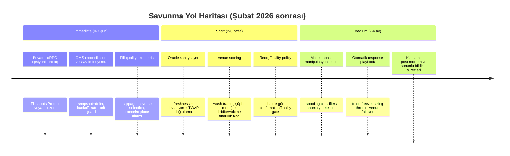

# Kripto Auto-Trade Botları İçin Niş Saldırı Vektörleri ve İleri Taktiklere Karşı Savunma Raporu

## Yönetici Özeti

Bu rapor, “az bilinen / niş” kripto al-sat taktiklerini **saldırı (threat) perspektifinden** sınıflandırır ve bir auto-trade botunu **sinyal→risk→icra** hattında nasıl sertleştireceğinizi anlatır. İstek “offensive exploit/taktik” detayları içerdiği için, **zarar vermeyi kolaylaştırabilecek uygulama talimatları, exploit zinciri tarifleri veya evasion (tespitten kaçma) yöntemleri** vermiyorum; bunun yerine, 2026 itibarıyla gerçekçi tehditleri, **önkoşullarını, uygulanabilirliklerini, etik/hukuki risklerini, savunma yöntemlerini ve izleme (telemetry) sinyallerini** sunuyorum. Bu sınır, özellikle MEV/sandwich, oracle manipülasyonu, spoofing, wash trading ve benzeri piyasa-manipülasyon teknikleri için kritik. Yine de botunuzu korumak için yeterince “aksiyon alınabilir” savunma kontrol noktaları veriyorum.

Öne çıkan risk kümeleri ve en hızlı savunma kazanımları:

- **Mempool/MEV kaynaklı saldırılar (sandwich/front‑run/back‑run)**: DEX swap emirleri ve kamusal mempool’a düşen işlemler, sandwich botlarının hedefidir; savunmada “private transaction”/korumalı RPC ve slippage/işlem parçalama gibi kontroller öne çıkar. entity["organization","Flashbots","mev protection project"] Protect, kamusal mempool’dan gizleme ve front‑run/sandwich’e karşı koruma iddiasıyla bunu ürünleştirir. citeturn0search1turn0search5turn0search13turn0search17  
- **Oracle ve zaman-kayması (stale) tabanlı manipülasyon**: Lending/derivatives protokollerinde “stale oracle report”, LP-token oracle zayıflığı veya flash-loan ile kısa süreli fiyat çarpıtma vakaları 2025’te de görülüyor. Savunma: oracle sanity-check, çok-kaynaklı doğrulama, TWAP/medianizer, “time-drift” alarmı ve anomali tespiti. citeturn0search10turn0search14turn2search12turn0search2  
- **CEX mikro-yapı manipülasyonları (spoofing, orderbook “spoofability”)**: Kripto CEX LOB (limit order book) üzerinde gerçek zamanlı spoofing tespiti üzerine yeni araştırmalar var; savunma: order-flow değişkenleri, iptal/yenileme oranı, book-imbalance ölçümleri ve fill-quality telemetrisi. citeturn0search3turn0search15turn1search23  
- **Sahte likidite / wash trading**: Hem akademik literatürde hem de düzenleyici/cezai uygulamada aktif bir alan; bot açısından risk “yanlış likidite varsayımı” ile sinyal ve execution’ın bozulmasıdır. Savunma: hacim/karşı taraf grafiği, anormal self-trade izleri, fiyat-etki tutarsızlığı ve venue puanlama. citeturn2search1turn2search9turn2search5turn2news44turn2news46  
- **Zincir düzeyi riskler (reorg/finality, L2 farklılıkları)**: Reorg küçük derinliklerde bile pratikte yaşanır; botun “işlem kesinleşti” varsayımı yanlışsa PnL ve risk hesapları bozulur. Savunma: finality/confirmations politikası, reorg izleme, idempotent state machine. citeturn1search16turn3search5turn3search19  
- **API/WebSocket/OMS (order management) kırılganlıkları**: Rate limit, WS kopmaları ve order-state tutarsızlığı canlıda “gizli” kayıplara dönüşür. Savunma: resmi rate-limit/WS limitlerine uyum, snapshot+delta book senkronu, backoff/retry, OMS reconciliation. citeturn3search2turn3search6turn3search10turn2search15turn3search13turn3search3turn3search7  

## Kapsam, Sınırlar ve Etik-Hukuki Çerçeve

- **Kapsam**: CEX ve DEX’lerde, auto-trade botlarının maruz kalabileceği **ileri düzey pazar mikro-yapı saldırıları**, **MEV türevleri**, **oracle manipülasyonu**, **wash trading kaynaklı yanıltma**, **reorg/finality riskleri** ve **altyapı/OMS zayıflıkları**. (Hedef borsalar, hedef zincirler, erişim seviyesi, co-location/özel RPC erişimi gibi detaylar **belirtilmemiş**; her madde için seçenekli not veriyorum.)  
- **Sınır**: “Saldırı yapmak” veya “tespitten kaçmak” için uygulanabilir tarifler (örn. oracle manipülasyonunun nasıl orkestre edileceği, spoofing’in nasıl kurgulanacağı, sandwich bot implementasyonu, wash‑trade evasion) paylaşmıyorum. Bu tür içerikler piyasa manipülasyonu ve/veya bilişim suistimali kapsamına girip kötüye kullanımı kolaylaştırır.  
- **Etik/hukuki risk**: Wash trading ve piyasa manipülasyonu, kriptoda da cezai/idarî yaptırımlara konu oluyor; Reuters’ın aktardığı “Operation Token Mirrors” soruşturması buna güncel bir örnek. citeturn2news44turn2news46  
- **Sorumlu bildirim**: Bir zafiyet fark ederseniz, ilgili protokolün/ürünün **bug bounty** veya güvenlik kanallarından raporlayın (ör. entity["organization","Immunefi","web3 bug bounty platform"] post-mortem’leri ve bounty süreçleri; ayrıca proje güvenlik e-postaları). citeturn0search6  

## Teknik Tehdit Taksonomisi ve Savunma Matrisi

Aşağıdaki tablo, niş/ileri taktikleri **“tehdit” olarak** ele alır. “Feasibility 2026” saldırgan açısından “yapılabilirlik”tir; bot savunması açısından, “ne kadar ciddiye alınmalı” sinyali verir.

| Kategori | Teknik (tehdit) | Kısa teknik tanım (savunma odaklı) | Önkoşullar | Feasibility 2026 | Etik/hukuki risk | Savunma (özet) | İzleme sinyalleri/telemetry |
|---|---|---|---|---|---|---|---|
| Mempool/MEV | Sandwich / front‑run / back‑run | Kamusal mempool’daki swap/işlemin etrafına daha öncelikli işlemler yerleşerek değerin “çıkarılması”; sonuç: bot daha kötü fiyattan fill olur. | Kamusal mempool görünürlüğü, yeterli gas/priority, DEX hedefi | Yüksek | Çok yüksek | Private tx (korumalı RPC), slippage & tx splitting, MEV korumalı cüzdan/RPC | Fill sonrası “beklenmeyen price impact”, anormal kötüleşen effective price, mempool’da benzer pattern’ler |
| Mempool/MEV | Private RPC / orderflow auction yan etkileri | İşlemi kamusal mempool’dan saklamak korur; ama relay/auction mekanizmaları kendine özgü risk/telemetry gerektirir. | Özel RPC/relay erişimi | Orta–Yüksek | Orta (savunma amaçlı kullanım) | Korumalı RPC kullan; “fallback mempool leak” durumunu izle; hız/geri ödeme ayarlarını politika ile yönet | “Tx public mempool’a düştü” alarmı; inclusion gecikmesi; revert oranları |
| Oracle | Stale oracle / time‑drift | “Geçerli ama eski” oracle raporu veya zaman drift’i, protokole yanlış fiyat enjekte edebilir; bot yanlış fiyatla trade/hedge eder. | Oracle mimarisi zayıflıkları, verinin tazeliği kontrol edilmemesi | Orta | Çok yüksek | Freshness (timestamp) gating, çok-kaynak doğrulama, TWAP/medianizer, deviasyon limitleri | Oracle timestamp sapması, spot‑TWAP farkı, tek blokta aşırı fiyat sıçraması |
| Oracle | LP-token oracle manip (flash-loan ile) | LP token fiyatını kısa süreli çarpıtarak kredi/pozisyon açma gibi suistimaller; bot riskini bozar. | Flash loan erişimi + zayıf oracle tasarımı | Orta | Çok yüksek | LP oracle’larında robust pricing (TWAP, liquidity-weighted), “single-block” manip alarmı | Bir blok/çok kısa pencerede TVL/price anomalisi; büyük swap + ardından borçlanma |
| CEX mikro-yapı | Spoofing / orderbook spoofability | Büyük sahte limit emirleriyle book dengesini yanıltıp fiyatı etkileyen manipülasyon; iptal ağırlıklı davranış. | L3/L2 order verisi, hızlı emir yönetimi | Orta | Çok yüksek | Order-flow anomalisi tespiti, cancel/replace oran eşikleri, “book impact vs trade impact” tutarlılık kontrolü | Cancel rate patlaması, microprice/imbalance anomali, “fiyat gitti sonra geri döndü” paterni |
| Likidite/volume | Wash trading / sahte hacim | Hacim/likidite şişirilir; bot sahte likiditeye güvenip agresif girer, kayma artar. | Venue içi koordinasyon veya bot ağları | Orta | Çok yüksek | Venue scoring, karşı taraf grafı, trade clustering, “volume–volatility” tutarsızlığı | Anormal tekrar eden karşı taraflar, round-trip trade kümeleri |
| Zincir | Reorg / finality riski | Blokların yeniden düzenlenmesi, botun “kesinleşti” sandığı fill/transferi geri alabilir; state tutarsızlığı. | Ağ koşulları/validator senkronu; özellikle düşük finality varsayımı | Düşük–Orta (büyük derinlikte) | Orta | Finality/confirmations politikası, reorg izleme, idempotent OMS/state | Reorg olayı, confirmation/finality gecikmesi, “tx dropped/replaced” |
| Altyapı | WS limit/bağlantı kopması, rate-limit ban | WS limitsiz/yanlış kullanılırsa feed düşer; REST 429/418 ile geçici ban; OMS körleşir. | API limitlerine uymama | Yüksek | Düşük | Resmi limitlere uyum, exponential backoff, snapshot+delta book sync | WS disconnect sayısı, 429/418 oranı, sequence gap uyarıları |

Bu tablodaki bazı maddelerin kamuya açık savunma kaynakları: sandwich/MEV’ye karşı koruma anlatımı (entity["organization","BNB Chain","layer1 ecosystem"] blogu dahil) citeturn0search0turn0search1turn0search5; oracle manipülasyonu post‑mortem’leri (Morpho forumu, araştırma yazıları) citeturn0search10turn0search14; spoofing/sahte emir tespiti üzerine yeni akademik çalışmalar citeturn0search3turn0search15turn1search23; wash trading tespiti literatürü ve hukuki örnekler citeturn2search1turn2search5turn2news44turn2news46.

## Birincil Kaynaklar ve Araçlar Haritası

Aşağıdaki kaynaklar “gizli forum/paste” yerine **açık web** ve **birincil dokümantasyon** (proje dokümanları, akademik makaleler, post‑mortem’ler) odaklıdır. Her birinin yanına 1 satır “neden önemli” notu ekledim.

**MEV / mempool koruma ve analiz**
- Flashbots Protect Docs: https://docs.flashbots.net/flashbots-protect/quick-start — Kamusal mempool’dan gizleme ile front‑run/sandwich’e karşı koruma ve ayarların mantığı. citeturn0search1  
- Flashbots Protect Overview: https://docs.flashbots.net/flashbots-protect/overview — Koruma yaklaşımının kapsamı/varsayımları (refund/no‑revert vb.). citeturn0search5  
- Flashbots RPC endpoint (GitHub): https://github.com/flashbots/rpc-endpoint — “Frontrunning protection” hedefiyle RPC endpoint yaklaşımı (uygulama ve uyarılar). citeturn0search13  
- MEV‑Share protokolü (GitHub + docs): https://github.com/flashbots/mev-share ve https://docs.flashbots.net/flashbots-mev-share/introduction — Orderflow auction kavramını ve bileşenlerini birincil kaynaktan anlamak. citeturn1search1turn1search13  
- MEV inspect (Rust): https://github.com/flashbots/mev-inspect-rs — Tarihsel MEV davranışını sınıflamak (arb/liquidation vb.) için analiz aracı. citeturn1search6  
- bloXroute Private Transactions: https://docs.bloxroute.com/bsc-and-eth/apis/frontrunning-protection/frontrunning-protection — Ethereum’da private tx gönderimiyle frontrun riskini azaltma yaklaşımı. citeturn0search17  
- Türkçe bağlam (genel kavram):  
  - BNB Chain MEV koruma yazısı (TR): https://www.bnbchain.org/tr-TR/blog/protecting-users-from-sandwich-attacks-bnb-chain-introduces-mev-protection-with-several-wallets-2 citeturn0search0  
  - Front‑running/Sandwich özetleri (TR): https://cryptonews.com/tr/academy/kriptoda-front-running-nedir-korunma-yontemleri/ citeturn0search16  

**Oracle manipülasyonu ve flash‑loan sınıfı saldırılar (savunma/tespit)**
- ArXiv (2025) oracle manipülasyonu önleyici tespit çerçevesi: https://arxiv.org/html/2502.06348v2 — Post‑mortem yerine “olmadan önce tespit” hedefleyen yaklaşım. citeturn0search2  
- Morpho post‑mortem (2025): https://forum.morpho.org/t/post-mortem-aerodrome-cusdo-usdc-amm-lp-oracle-manipulation-on-morpho-lending-market/1794 — LP oracle manipülasyonunun nasıl zarar ürettiğine dair somut vaka. citeturn0search10  
- SecPLF (ACM): https://dl.acm.org/doi/pdf/10.1145/3634737.3637681 — Flash‑loan kolaylaştırmalı oracle manipülasyonuna karşı protokol tasarım savunmaları. citeturn2search12  
- FlashGuard (2025): https://arxiv.org/pdf/2503.01944 — Flash‑loan sınıfı saldırılara runtime tespit/mitigasyon yaklaşımı. citeturn2search0  
- Immunefi post‑mortem (Enzyme örneği): https://medium.com/immunefi/enzyme-finance-price-oracle-manipulation-bug-fix-postmortem-4e1f3d4201b5 — Sorumlu bildirim ve bug-fix sürecinin nasıl yürüdüğüne örnek. citeturn0search6  

**CEX mikro-yapı manipülasyonu / spoofing tespiti**
- ArXiv (2025) kripto CEX spoofing tespiti: https://arxiv.org/html/2504.15908v1 — LOB spoofing’ini gerçek zamanlı tespit için yapılandırılmış değişkenler/NN yaklaşımı. citeturn0search3  
- Oxford‑Man spoofing modeli (PDF): https://www.oxford-man.ox.ac.uk/wp-content/uploads/2020/05/Spoofing-and-Price-Manipulation-in-Order-Driven-Markets.pdf — Spoofing’in teorik fiyat etkisi ve geri dönüş paternleri. citeturn0search15  

**Wash trading tespiti ve hukuki bağlam**
- ACM (2025) CEX wash trading tespiti: https://dl.acm.org/doi/10.1145/3702359.3702363 — Merkezî borsalarda otomatik tespit sinyalleri. citeturn2search1  
- Detecting & Quantifying Wash Trading (PDF): https://berkeley-defi.github.io/assets/material/Detecting%20and%20Quantifying%20Wash%20Trading.pdf — DEX bağlamında tespit metodolojisi. citeturn2search13  
- Reuters (2025) market manipülasyonu/wash trading davası örnekleri: (Reuters linkleri kaynak olarak) — “gerçek yaptırım riski” olduğunu gösterir. citeturn2news44turn2news46  

**Finality / reorg ve altyapı**
- Ethereum PoS attack/defense (resmi doküman): https://ethereum.org/developers/docs/consensus-mechanisms/pos/attack-and-defense/ — Finality gadget ve saldırı sınıfları. citeturn3search5  
- “Single-slot finality” notları (Vitalik’in notları): https://notes.ethereum.org/%40vbuterin/single_slot_finality — Epoch/finality zamanlaması ve çıkarımlar. citeturn3search19  
- Binance WS limitleri (resmi Academy): https://www.binance.com/en/academy/articles/what-are-binance-websocket-limits — WS limitleri, hata türleri, reconnect/backoff. citeturn3search2  
- Binance rate-limit ban’den kaçınma: https://www.binance.com/en/academy/articles/how-to-avoid-getting-banned-by-rate-limits — 429/418 ve header izleme pratikleri. citeturn3search6  
- Binance local order book sync tutorial: https://www.binance.com/en/academy/articles/local-order-book-tutorial-part-3-keeping-the-websocket-connection — Snapshot+delta ile doğru order book senkronu (sequence gap, event discard vb.). citeturn3search10  
- Deribit OMS best practices: https://support.deribit.com/hc/en-us/articles/29514039279773-Order-Management-Best-Practices — OMS akışı, cancel/replace, latency optimizasyonu. citeturn2search15  
- Coinbase Advanced Trade WS/REST rate limits (resmi): https://docs.cdp.coinbase.com/coinbase-app/advanced-trade-apis/websocket/websocket-rate-limits ve https://docs.cdp.coinbase.com/exchange/rest-api/rate-limits citeturn3search3turn3search7  

## Bot Sertleştirme: Kontrollerin Nereye Takılacağı ve Ne İzlenecek

“Tek bir savunma” yok; başarı, kontrolleri **ingestion → sinyal → risk → execution → monitoring** zincirinde basamaklandırmakla gelir. Aşağıdaki tablo, her tehdit sınıfı için “bot mimarisinde nerede kontrol” gerektiğini özetler.

| Tehdit | Ingestion (veri) | Signal (sinyal) | Risk/Position | Execution/OMS | Monitoring/Alert |
|---|---|---|---|---|---|
| Sandwich/front‑run/back‑run | Mempool/tx visibility bilgisi (varsa) | Slippage-aware sinyal gating | Max adverse selection limit; “volatility throttle” | Private RPC + fallback; gas/priority policy | Fill-quality (VWAP vs fill), “MEV‑like pattern” alarmı |
| Oracle stale/time‑drift | Oracle timestamp + kaynak doğrulama | “Price sanity” filtresi (spot vs TWAP) | Position cap; stop genişletme/işlem bloklama | Şüpheli durumda trade’i iptal/ertelemek | Oracle deviasyon & freshness alarmı |
| LP-oracle / flash‑loan etkisi | Liquidity/TVL ve price impact ölçümleri | “Single-block spike” filtresi | Leverage düşür; borrow/hedge limitleri | Blok bazlı “cooldown” | Büyük swap + borç/pozisyon açma korelasyonu |
| Spoofing / orderbook manip | L2/L3 book; cancel/replace oranı | Microprice/imbalance anomali filtresi | Spread genişlemesine göre sizing düşür | Limit→market tercihini koşulla | Cancel spikes, book-thinness, fill slippage |
| Wash trading / fake volume | Venue scoring datası | “Volume confirming signal” yerine çoklu doğrulama | Likiditeye göre max order size | Görünür likiditeye göre parçalama | Round-trip trade kümeleri, sahte hacim alarmları |
| Reorg/finality | Block/finality feed | “On-chain fill” doğrulama | Finality gelene kadar risk sınırlama | Idempotent state; reconcile | Reorg event, tx dropped/replaced |

Aşağıdaki iki küçük pseudocode parçası, exploit değil; **savunma telemetrisi** için örnek şablondur (kendi stack’inize uyarlarsınız):

```python
# PSEUDO: Fill-quality / MEV-benzeri adverse selection alarmı
def compute_fill_quality(expected_px, fill_px, side):
    # side: +1 buy, -1 sell
    # buy'da fill_px > expected_px ise kötüleşme; sell'de fill_px < expected_px kötüleşme
    slip = side * (fill_px - expected_px)
    return slip

def mev_like_alarm(slippage_bps, short_window_bps_p95, threshold_mult=3):
    # kısa pencerede slippage dağılımına göre adaptif alarm
    return slippage_bps > threshold_mult * short_window_bps_p95
```

```python
# PSEUDO: Oracle freshness + deviasyon kapısı
def oracle_gate(oracle_ts, now_ts, oracle_px, twap_px, max_age_s, max_dev_pct):
    if now_ts - oracle_ts > max_age_s:
        return False, "stale_oracle"
    dev = abs(oracle_px - twap_px) / twap_px
    if dev > max_dev_pct:
        return False, "oracle_deviation"
    return True, "ok"
```

Özellikle **private transaction** savunması için iki pratik seçenek (detaylar erişiminize bağlı):  
- entity["organization","Flashbots","mev protection project"] Protect / RPC endpoint: kamusal mempool’dan saklayarak frontrun/sandwich riskini düşürme hedefi. citeturn0search1turn0search13  
- entity["company","bloXroute","blockchain infrastructure provider"] private tx API’leri: benzer amaçla “private transactions” anlatımı. citeturn0search17  

“CEX orderbook doğruluğu” için en kritik kontrol, **snapshot+delta senkronu** ve WS limitlerine uyumdur; Binance bunu Academy’de adım adım anlatıyor. citeturn3search10turn3search2turn3search6  

Wash trading ve sahte likiditeye karşı, literatürün ortak mesajı: tek metrik (hacim) yerine **graf/cluster** ve **patern** analizi kullanın; ayrıca bunun hukuki riskli bir alan olduğunu unutmayın. citeturn2search1turn2search5turn2news44turn2news46  

## Önceliklendirilmiş Savunma Yol Haritası ve Olay Müdahalesi Akışı

Aşağıdaki roadmap, “hemen canlı kaybı azalt” → “sistematik tespit” → “ileri düzey otomasyon” şeklinde sıralıdır.



İstenen “detection→response→mitigation” hattı:

```mermaid
flowchart TD
    A[Telemetry Ingestion\n(orderbook, trades, fills,\noracle, chain events)] --> B[Detectors\nrules + anomaly models]
    B --> C{Severity?}
    C -->|Low| D[Log + Dashboard\ntrend takip]
    C -->|Medium| E[Mitigation\nposition throttle,\norder size cap,\nspread-aware execution]
    C -->|High| F[Emergency\ntrading halt / venue disable\nfallback to safer route]
    E --> G[Post-Event Review\nroot cause + tuning]
    F --> G
    G --> H[Disclosure Path\nbug bounty / security contact]
```

**Pratik “response” politikası** (kısa ama etkili):  
- “Medium” seviyede: pozisyon büyüklüğünü düşür, sadece limit emir kullan, daha geniş bekleme/confirmations, venue’i geçici yavaşlat. (Risk motoru + execution policy’de uygulanır.)  
- “High” seviyede: yeni pozisyon açmayı durdur, sadece risk azaltıcı emirler (reduce-only) çalıştır, veri kaynağı/venue failover.  

**Sorumlu bildirim kanalları**:  
- Protokol/uygulama bug bounty programları (ör. entity["organization","Immunefi","web3 bug bounty platform"] üzerinden yürütülen süreçler ve post‑mortem pratikleri). citeturn0search6  
- Resmi dokümantasyon ve güvenlik iletişim kanalları (Flashbots, borsa API dokümanları, ilgili proje security@). (Kanal isimleri projeden projeye değiştiği için burada “opsiyon” bırakıyorum.)

---

Bu raporu botunuza “gerçekten uygulanabilir” hale getirmek için 3 bilgi eksik: **hedef ekosistem (CEX mi DEX mi / hangi zincir), erişim seviyesi (private RPC, validator/builder ilişkisi var mı), strateji ufku (HFT mi, dakika-saat mi, swing mi)**. Bu detaylar belirtilmediği için her bölümde seçenekli savunma verdim; yine de üstteki “Immediate” adımlar, çoğu botta en hızlı ölçülebilir iyileştirmeyi sağlar.