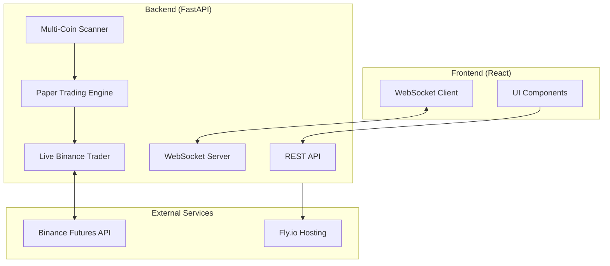
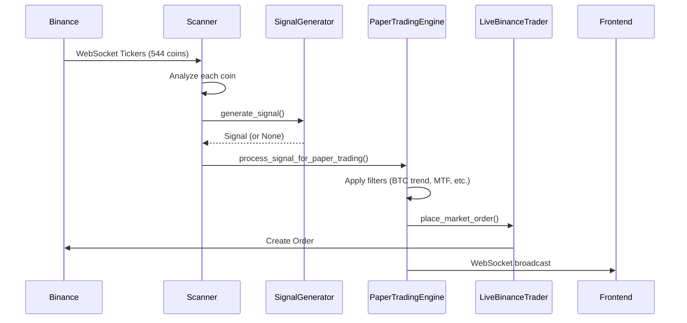
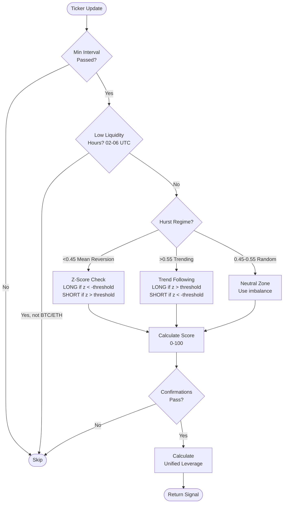
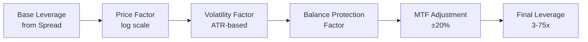
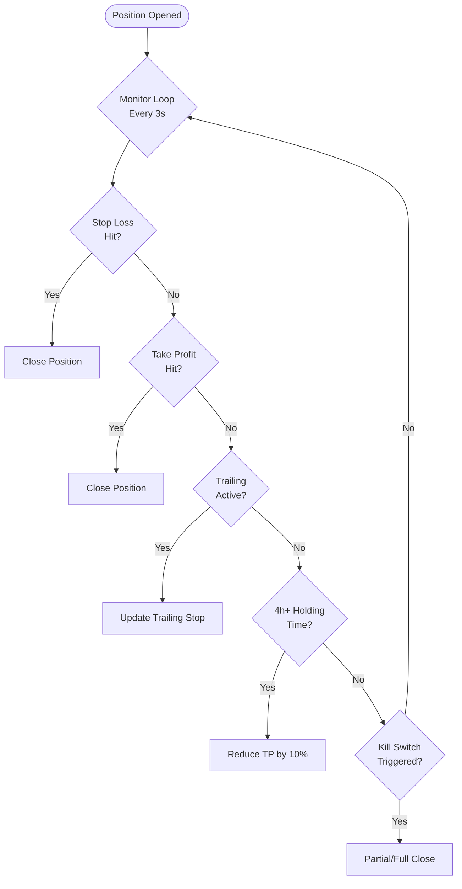

# HHQ-1 Quant Monitor - Developer Guide

> **ÖNEMLİ:** Bu dosya projenin ana referans dokümanıdır. Her geliştirme öncesi buraya bakılmalıdır.
> Son güncelleme: 2026-02-04

## 🔒 Stabil Rollback Noktası

| Tarih | Commit | Açıklama |
|-------|--------|----------|
| 2026-02-04 | `7e4230d` | Phase 133 sonrası stabil versiyon (Hurst VETO, Trend VETO, Auto-Breakeven) |

**Rollback komutu:**
```bash
git checkout 7e4230d -- main.py
flyctl deploy --detach
```

---

## 📖 İçindekiler

1. [Proje Genel Bakış](#proje-genel-bakış)
2. [Mimari](#mimari)
3. [Algoritma Akışları](#algoritma-akışları)
4. [Kritik Dosyalar](#kritik-dosyalar)
5. [Öğrenilen Dersler](#öğrenilen-dersler)
6. [Sık Karşılaşılan Sorunlar](#sık-karşılaşılan-sorunlar)
7. [Deployment](#deployment)
8. [Geliştirme Geçmişi](#geliştirme-geçmişi)

---

## 🎯 Proje Genel Bakış

HHQ-1 Quant Monitor, 500+ kripto paritesinde gerçek zamanlı sinyal üretimi ve otomatik trading yapan bir platformdur.

### Temel Özellikler
- **Multi-Coin Scanner:** 544 coin'i eşzamanlı analiz eder
- **Sinyal Üretimi:** 13 katmanlı konfirmasyon sistemi
- **Live Trading:** Binance Futures entegrasyonu
- **Paper Trading:** Simülasyon modu
- **Risk Yönetimi:** Kill switch, balance protection, blacklist sistemi

### Teknoloji Stack
| Bileşen | Teknoloji |
|---------|-----------|
| Backend | Python, FastAPI, asyncio |
| Frontend | React, TypeScript, Vite |
| Exchange API | ccxt (Binance Futures) |
| Deployment | Fly.io |
| Real-time | WebSocket |

---

## 🏗️ Mimari



### Veri Akışı



---

## 🔄 Algoritma Akışları

### 1. Sinyal Üretimi (SignalGenerator)



### 2. Unified Leverage Hesaplaması (Phase 99)



**Formül:**
```
final_leverage = base_spread × price_factor × volatility_factor × balance_mult × mtf_mult
```

| Faktör | Açıklama | Değer Aralığı |
|--------|----------|---------------|
| base_spread | Spread seviyesine göre | 3-50x |
| price_factor | Log ölçekli fiyat | 0.3-1.0 |
| volatility_factor | ATR% bazlı | 0.3-1.0 |
| balance_mult | Drawdown koruması | 0.5-1.0 |
| mtf_mult | TF alignment bonus | 0.6-1.2 |

### 3. Pozisyon Yönetimi



### 4. Binance Senkronizasyonu


---

## 📁 Kritik Dosyalar

### Backend (main.py)
| Satır Aralığı | Bileşen | Açıklama |
|---------------|---------|----------|
| 608-740 | `get_positions()` | Binance pozisyon senkronizasyonu |
| 743-760 | `set_leverage()` | Leverage ayarı |
| 757-810 | `place_market_order()` | Order yerleştirme |
| 1120-1285 | Sync Loop | Binance senkronizasyon döngüsü |
| 2388-2422 | `CoinOpportunity` | Coin veri sınıfı |
| 3530-3578 | `analyze_all()` | Tüm coinleri analiz et |
| 4244-4600 | `process_signal_for_paper_trading()` | Sinyal işleme |
| 7982-8600 | `SignalGenerator` | Sinyal üretici sınıf |
| 8448-8530 | Unified Leverage | Birleşik leverage hesabı |
| 8582-9800 | `PaperTradingEngine` | Paper trading motoru |
| 10060-10130 | `close_position()` | Pozisyon kapatma |

### Frontend
| Dosya | Açıklama |
|-------|----------|
| `components/ActiveSignalsPanel.tsx` | Sinyal gösterimi |
| `components/PositionsTable.tsx` | Pozisyon tablosu |
| `hooks/useWebSocket.ts` | WebSocket bağlantısı |

---

## 📚 Öğrenilen Dersler

### 1. Leverage Tutarsızlığı (Phase 99)
**Problem:** UI'da gösterilen leverage ile Binance'e gönderilen leverage farklıydı.

**Sebep:** İki farklı yerde leverage hesaplanıyordu:
- `SignalGenerator` (UI için)
- `process_signal_for_paper_trading` (Binance için)

**Çözüm:** Tüm hesaplamayı `SignalGenerator`'da birleştirdik, `process_signal_for_paper_trading` sadece MTF bonus/penalty uyguluyor.

### 2. Trade History Kaybolması (Phase 100)
**Problem:** Binance'da harici olarak kapanan pozisyonlar trade history'de görünmüyordu.

**Sebep:** Sync döngüsü pozisyonları sadece siliyordu, trade history'e kaydetmiyordu.

**Çözüm:** Sync döngüsünde kapanan pozisyonları önce `trades` listesine ekle, sonra sil.

### 3. Paper vs Live Trading Tutarlılığı
**Bulgu:** Algoritma her iki modda da aynı. Tek fark `place_market_order()` çağrısı.

### 4. Timezone Farkı
**Dikkat:** Fly.io UTC timezone kullanıyor. Türkiye saati UTC+3.
- Log'da 18:30 görüyorsan, Türkiye'de 21:30.

### 5. Cross Margin Leverage Gösterimi
**Dikkat:** Binance cross margin'da `leverage` değeri her zaman 1x döner.
Gerçek leverage: `notional / margin` formülüyle hesaplanmalı.

---

## ⚠️ Sık Karşılaşılan Sorunlar

### Sinyal Gelmiyor
1. Scanner çalışıyor mu? → `/scanner/status` endpoint
2. WebSocket bağlı mı? → UI'da "Son: XX:XX" kontrolü
3. Z-Score eşiği çok mu yüksek? → Settings'den düşür
4. Market sakin mi? → Düşük volatilite dönemlerinde normal

### Backend Yanıt Vermiyor
1. Makineyi restart et: `flyctl machine restart <ID> --app hhq-1-quant-monitor`
2. Logları kontrol et: `flyctl logs --app hhq-1-quant-monitor --no-tail`

### Pozisyon Mismatch
Binance'deki pozisyon sayısı ile Engine'deki farklıysa:
- Log: `⚠️ Position mismatch: Binance=X, Engine=Y`
- 3 saniye bekle, otomatik senkronize olur

### API Rate Limit
- Fast mode kullan: `get_positions(fast=True)`
- Sync interval: 3 saniye (2400 weight/min limitinin %60'ı)

---

## 🚀 Deployment

### Local Development
```bash
# Backend
cd /Users/ahmetdeveci/Downloads/hhq-1-quant-monitor
python3 main.py

# Frontend (ayrı terminal)
npm run dev
```

### Production Deploy
```bash
# Commit ve push
git add .
git commit -m "Description"
git push origin main

# Fly.io deploy
flyctl deploy --detach

# Status kontrol
flyctl status --app hhq-1-quant-monitor
flyctl logs --app hhq-1-quant-monitor --no-tail
```

### Rollback
```bash
# Son deployment'ı geri al
git revert HEAD --no-edit
git push origin main
flyctl deploy
```

---

## 📝 Geliştirme Geçmişi

| Tarih | Phase | Açıklama |
|-------|-------|----------|
| 2026-02-04 | 133 | Signal Filtering: Auto-breakeven, Hurst VETO (>0.55), Trend VETO |
| 2026-02-02 | 99 | Unified Leverage: UI ve Binance için tek hesaplama |
| 2026-02-02 | 100 | Trade History Fix: Harici kapatmalar kaydediliyor |
| ... | ... | ... |

---

## 🔧 Yeni Geliştirme Kontrol Listesi

Yeni bir özellik eklerken:

- [ ] Bu dosyayı oku
- [ ] İlgili kod bölümlerini `main.py`'da bul
- [ ] Değişikliği yap
- [ ] `python3 -m py_compile main.py` ile syntax kontrolü
- [ ] Local test
- [ ] Git commit + push
- [ ] `flyctl deploy --detach`
- [ ] Logları kontrol et
- [ ] Bu dosyayı güncelle

---

> **Not:** Bu dosya her önemli geliştirmeden sonra güncellenmelidir.
