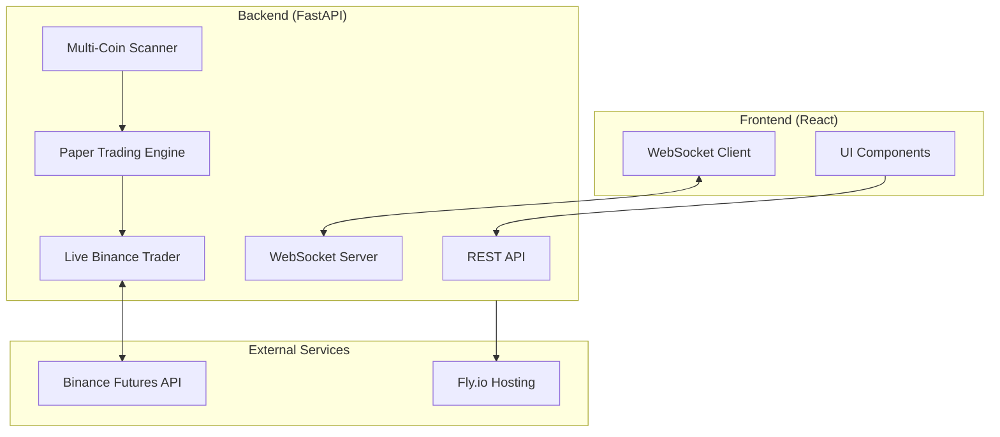
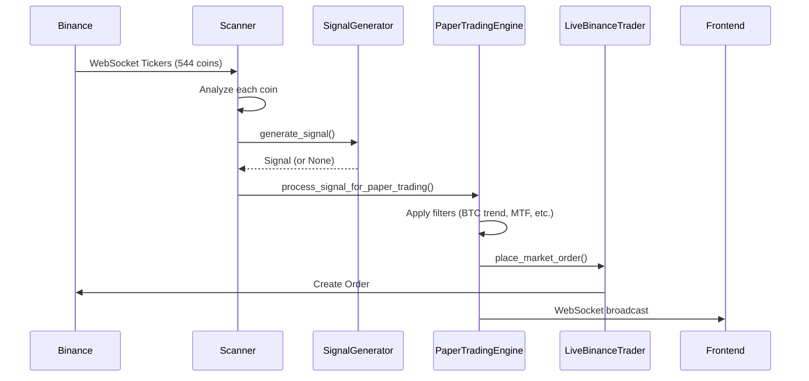
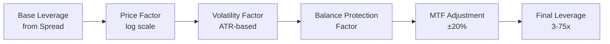

# HHQ-1 Quant Monitor - Developer Guide

> **ÖNEMLİ:** Bu dosya projenin ana referans dokümanıdır. Her geliştirme öncesi buraya bakılmalıdır.
> Son güncelleme: 2026-02-04

## 🔒 Stabil Rollback Noktası

| Tarih | Commit | Açıklama |
|-------|--------|----------|
| 2026-02-04 | `081ed8f` | Phase 133 rollback sonrası stabil (Phase 135 öncesi) |
| 2026-02-04 | `7e4230d` | Phase 133 sonrası stabil versiyon (Hurst VETO, Trend VETO, Auto-Breakeven) |

**Rollback komutu:**
```bash
git checkout 7e4230d -- main.py
flyctl deploy --detach
```

---

## 📖 İçindekiler

1. [Proje Genel Bakış](#proje-genel-bakış)
2. [Mimari](#mimari)
3. [Algoritma Akışları](#algoritma-akışları)
4. [Kritik Dosyalar](#kritik-dosyalar)
5. [Öğrenilen Dersler](#öğrenilen-dersler)
6. [Sık Karşılaşılan Sorunlar](#sık-karşılaşılan-sorunlar)
7. [Deployment](#deployment)
8. [Geliştirme Geçmişi](#geliştirme-geçmişi)

---

## ⚠️ Önemli Notlar

> **AMS Makinesi:** Amsterdam (AMS) makinesi her zaman **STOPPED** durumunda kalmalıdır. Sadece Singapore (SIN) makinesi aktif olarak çalıştırılır.

---

## 🎯 Proje Genel Bakış

HHQ-1 Quant Monitor, 500+ kripto paritesinde gerçek zamanlı sinyal üretimi ve otomatik trading yapan bir platformdur.

### Temel Özellikler
- **Multi-Coin Scanner:** 544 coin'i eşzamanlı analiz eder
- **Sinyal Üretimi:** 13 katmanlı konfirmasyon sistemi
- **Live Trading:** Binance Futures entegrasyonu
- **Paper Trading:** Simülasyon modu
- **Risk Yönetimi:** Kill switch, balance protection, blacklist sistemi

### Teknoloji Stack
| Bileşen | Teknoloji |
|---------|-----------|
| Backend | Python, FastAPI, asyncio |
| Frontend | React, TypeScript, Vite |
| Exchange API | ccxt (Binance Futures) |
| Deployment | Fly.io |
| Real-time | WebSocket |

---

## 🏗️ Mimari



### Veri Akışı



---

## 🔄 Algoritma Akışları

### 1. Sinyal Üretimi (SignalGenerator)


### 2. Unified Leverage Hesaplaması (Phase 99)



**Formül:**
```
final_leverage = base_spread × price_factor × volatility_factor × balance_mult × mtf_mult
```

| Faktör | Açıklama | Değer Aralığı |
|--------|----------|---------------|
| base_spread | Spread seviyesine göre | 3-50x |
| price_factor | Log ölçekli fiyat | 0.3-1.0 |
| volatility_factor | ATR% bazlı | 0.3-1.0 |
| balance_mult | Drawdown koruması | 0.5-1.0 |
| mtf_mult | TF alignment bonus | 0.6-1.2 |

### 3. Pozisyon Yönetimi


### 4. Binance Senkronizasyonu


---

## 📁 Kritik Dosyalar

### Backend (main.py)
| Satır Aralığı | Bileşen | Açıklama |
|---------------|---------|----------|
| 608-740 | `get_positions()` | Binance pozisyon senkronizasyonu |
| 743-760 | `set_leverage()` | Leverage ayarı |
| 757-810 | `place_market_order()` | Order yerleştirme |
| 1120-1285 | Sync Loop | Binance senkronizasyon döngüsü |
| 2388-2422 | `CoinOpportunity` | Coin veri sınıfı |
| 3530-3578 | `analyze_all()` | Tüm coinleri analiz et |
| 4244-4600 | `process_signal_for_paper_trading()` | Sinyal işleme |
| 7982-8600 | `SignalGenerator` | Sinyal üretici sınıf |
| 8448-8530 | Unified Leverage | Birleşik leverage hesabı |
| 8582-9800 | `PaperTradingEngine` | Paper trading motoru |
| 10060-10130 | `close_position()` | Pozisyon kapatma |

### Frontend
| Dosya | Açıklama |
|-------|----------|
| `components/ActiveSignalsPanel.tsx` | Sinyal gösterimi |
| `components/PositionsTable.tsx` | Pozisyon tablosu |
| `hooks/useWebSocket.ts` | WebSocket bağlantısı |

---

## 📚 Öğrenilen Dersler

### 1. Leverage Tutarsızlığı (Phase 99)
**Problem:** UI'da gösterilen leverage ile Binance'e gönderilen leverage farklıydı.

**Sebep:** İki farklı yerde leverage hesaplanıyordu:
- `SignalGenerator` (UI için)
- `process_signal_for_paper_trading` (Binance için)

**Çözüm:** Tüm hesaplamayı `SignalGenerator`'da birleştirdik, `process_signal_for_paper_trading` sadece MTF bonus/penalty uyguluyor.

### 2. Trade History Kaybolması (Phase 100)
**Problem:** Binance'da harici olarak kapanan pozisyonlar trade history'de görünmüyordu.

**Sebep:** Sync döngüsü pozisyonları sadece siliyordu, trade history'e kaydetmiyordu.

**Çözüm:** Sync döngüsünde kapanan pozisyonları önce `trades` listesine ekle, sonra sil.

### 3. Paper vs Live Trading Tutarlılığı
**Bulgu:** Algoritma her iki modda da aynı. Tek fark `place_market_order()` çağrısı.

### 4. Timezone Farkı
**Dikkat:** Fly.io UTC timezone kullanıyor. Türkiye saati UTC+3.
- Log'da 18:30 görüyorsan, Türkiye'de 21:30.

### 5. Cross Margin Leverage Gösterimi
**Dikkat:** Binance cross margin'da `leverage` değeri her zaman 1x döner.
Gerçek leverage: `notional / margin` formülüyle hesaplanmalı.

---

### Sinyal Gelmiyor - Detaylı Troubleshooting

#### Adım 1: Log Akışını Kontrol Et

Fly.io Metrics'te şu sorguları çalıştır:

| Query | Log Çıkıyor mu? | Anlam |
|-------|-----------------|-------|
| `*Z_PASS*` | ✅ Evet | Z-Score threshold geçildi |
| `*PRE_SCORE*` | ✅ Evet | Skor hesaplaması tamamlandı |
| `*SCORE_PASS*` | ✅ Evet | Min skor aşıldı → Sinyal üretildi |
| `*SCORE_LOW*` | ⚠️ Evet | Skor yetersiz → Sinyal reddedildi |

#### Adım 2: Akış Noktalarını Belirle

```
Ticker → Z_PASS → Layer 1-15 → PRE_SCORE → SCORE Check → SCORE_PASS/LOW
         ↑                        ↑              ↑
         8522                    8791           8795
```

**Sorun Tanılama:**
- Z_PASS var, PRE_SCORE yok → **Layer 1-15 arasında exception veya return None**
- PRE_SCORE var, SCORE_PASS yok → **Min skor çok yüksek veya skor düşük**
- Hiç log yok → **Scanner çalışmıyor**

#### Adım 3: Yaygın Kök Nedenler

| Sorun | Belirti | Çözüm |
|-------|---------|-------|
| Tanımsız değişken | Z_PASS var, PRE_SCORE yok | `generate_signal` fonksiyonunda tanımsız değişken referansı kontrol et |
| Min skor çok yüksek | PRE_SCORE'da `score < min` | Settings'den min_score düşür (önerilen: 55-65) |
| Kill Switch Block | `BLOCKED` logu görünür | 24 saat bekle veya kill_switch_fault_tracker temizle |
| MTF VETO (-100) | Score negatif | BTC trend değişikliğini bekle |

#### Adım 4: Phase 137'de Bulunan Kritik Bug (Referans)

**Sorun:** Z_PASS logları çıkıyor ama PRE_SCORE asla görünmüyordu.

**Kök Neden:** `generate_signal` fonksiyonunda (line ~8760) tanımsız `opportunity` değişkeni kullanılıyordu:
```python
# HATALI KOD:
adx = getattr(opportunity, 'adx', 25.0) if opportunity else 25.0
# ↑ opportunity bu fonksiyona parametre olarak geçirilmiyordu!
```

Bu satır her çalıştığında **NameError** fırlatıyordu ve tüm exception'lar sessizce yutulduğu için sinyaller kayboluyordu.

**Çözüm:**
```python
# DÜZELTİLMİŞ KOD:
adx = 25.0  # Parametresi olmayan değişken yerine default değer
```

**Öğrenilen Ders:** Yeni layer eklerken:
1. Kullanılan tüm değişkenlerin fonksiyon scope'unda tanımlı olduğunu doğrula
2. Parametre listesinde yoksa ve global değilse → NameError olur
3. Test için `python3 -m py_compile main.py` yeterli değil, runtime error yakalanmaz

#### Adım 5: Debug Log Ekleme

Sinyal akışını takip etmek için trace log ekle:
```python
# Z_PASS sonrası, layer'ların başına:
logger.info(f"📍 LAYER_X: {symbol} score={score}")

# PRE_SCORE var ama sorun devam ediyorsa:
logger.info(f"📍 PRE_SCORE: {symbol} score={score} min={min_score_required} | reasons: {reasons}")
```


### Backend Yanıt Vermiyor
1. Makineyi restart et: `flyctl machine restart <ID> --app hhq-1-quant-monitor`
2. Logları kontrol et: `flyctl logs --app hhq-1-quant-monitor --no-tail`

### Pozisyon Mismatch
Binance'deki pozisyon sayısı ile Engine'deki farklıysa:
- Log: `⚠️ Position mismatch: Binance=X, Engine=Y`
- 3 saniye bekle, otomatik senkronize olur

### API Rate Limit
- Fast mode kullan: `get_positions(fast=True)`
- Sync interval: 3 saniye (2400 weight/min limitinin %60'ı)

---

## 🚀 Deployment

### Local Development
```bash
# Backend
cd /Users/ahmetdeveci/Downloads/hhq-1-quant-monitor
python3 main.py

# Frontend (ayrı terminal)
npm run dev
```

### Production Deploy
```bash
# Commit ve push
git add .
git commit -m "Description"
git push origin main

# Fly.io deploy
flyctl deploy --detach

# Status kontrol
flyctl status --app hhq-1-quant-monitor
flyctl logs --app hhq-1-quant-monitor --no-tail
```

### Rollback
```bash
# Son deployment'ı geri al
git revert HEAD --no-edit
git push origin main
flyctl deploy
```

---

## 📝 Geliştirme Geçmişi

| Tarih | Phase | Açıklama |
|-------|-------|----------|
| 2026-02-05 | 146 | Live Trailing State Persistence |
| 2026-02-05 | 145 | Live Position TP/SL/Trail Display |
| 2026-02-05 | 144 | ROI-Based Trail Activation (leverage + exit_tightness) |
| 2026-02-05 | 143 | Strong Trend Filter (4H 20 mum counter-trend penalty) |
| 2026-02-05 | 142 | Portfolio Recovery Trailing System |
| 2026-02-05 | 141 | Size vs Contracts Standardization |
| 2026-02-05 | 140 | Modular Architecture (backend/ package) |
| 2026-02-05 | 139 | Type Consistency (CloseReason types) |
| 2026-02-05 | 138 | Detailed Close Reasons with emojis |
| 2026-02-04 | 134 | Enhanced Scoring: RSI momentum, Volume spike, SMT divergence, VWAP, POC |
| 2026-02-04 | 133 | Signal Filtering: Auto-breakeven, Hurst VETO (>0.55), Trend VETO |
| 2026-02-02 | 99 | Unified Leverage: UI ve Binance için tek hesaplama |
| 2026-02-02 | 100 | Trade History Fix: Harici kapatmalar kaydediliyor |

---

## 📘 Phase 138-141 Detaylı Dokümantasyon

### Phase 138: Detailed Close Reasons (Emoji System)

**Amaç:** Trade kapanış nedenlerini daha okunabilir ve anlaşılır hale getirmek.

**Eski sistem:**
```python
reason = "SL_HIT"  # Kısa ve belirsiz
```

**Yeni sistem:**
```python
reason = "🔴 SL: Ana SL tetiklendi @ $0.5432 (-%2.5)"  # Emoji + detaylı bilgi
```

**Reason Kategorileri:**
| Kategori | Emoji | Örnekler |
|----------|-------|----------|
| Stop Loss | 🔴 🛑 | `🔴 SL: Ana SL tetiklendi` |
| Take Profit | 🟢 ✅ | `🟢 TP: TP1 seviyesi @ $price` |
| Trailing | 📈 | `📈 TRAIL: Trailing stop aktif` |
| Kill Switch | ⚠️ 🚨 | `⚠️ KILL: Margin kaybı ≥%30` |
| Time-Based | ⏰ ⏳ | `⏰ TIME: 4h kuralı (reduce)` |
| Recovery | 🔄 | `🔄 RECOVERY: Başabaşa dönüş` |
| Adverse | ⚡ | `⚡ ADVERSE: 8h+ zararda` |
| Manual | 👤 | `👤 MANUAL: Kullanıcı kapattı` |
| Emergency | 🚨 | `🚨 EMERGENCY: -%15 acil çıkış` |

---

### Phase 139: Type Consistency (TypeScript/Python Sync)

**Problem:** 
- `types.ts` sadece 8 CloseReason tanımlıyordu
- Backend 20+ farklı reason kullanıyordu
- UI'da bilinmeyen reason'lar gösterilmiyordu

**Çözüm:**

#### 1. `types.ts` Güncellemesi
```typescript
// Önceki (eksik):
closeReason: 'SL' | 'TP' | 'TRAILING' | 'MANUAL' | 'SIGNAL' | 'TP1' | 'SL1' | 'RESCUE';

// Yeni (kapsamlı):
export type CloseReason = 
  // Stop Loss variants
  | 'SL' | 'SL_HIT' | 'EMERGENCY_SL'
  // Take Profit variants  
  | 'TP' | 'TP_HIT' | 'TP1'
  // Trailing Stop
  | 'TRAILING' | 'TRAILING_STOP'
  // Kill Switch
  | 'KILL_SWITCH_FULL' | 'KILL_SWITCH_PARTIAL'
  // Time-based
  | 'TIME_GRADUAL' | 'TIME_FORCE' | 'TIME_REDUCE_4H' | 'TIME_REDUCE_8H'
  // Recovery & Adverse
  | 'RECOVERY_EXIT' | 'ADVERSE_TIME_EXIT'
  // External & Other
  | 'EXTERNAL' | 'MANUAL' | 'BREAKEVEN' | 'RESCUE' | 'END' | 'SIGNAL';
```

#### 2. Trade Interface Güncellemesi
```typescript
export interface Trade {
  // ... diğer alanlar
  reason?: string;            // Primary field (backend'den)
  closeReason?: CloseReason;  // Legacy compatibility
}
```

#### 3. `translateReason` Fonksiyonu (`App.tsx`)
```typescript
const translateReason = (reason: string | undefined): string => {
  // Phase 138 emoji reasons - already formatted
  if (reason?.includes('🔴 SL:') || reason?.includes('🟢 TP:')) {
    return reason;  // Pass through as-is
  }
  
  const mapping: Record<string, string> = {
    'SL': '🛑 SL: Trailing Stop Tetiklendi (3-tick onayı)',
    'TP': '✅ TP: Hedef Fiyata Ulaşıldı (R:R oranı)',
    'KILL_SWITCH_FULL': '🚨 KS Tam: Margin Kaybı ≥%50 → Tam Kapatma',
    'TIME_REDUCE_4H': '⏰ Zaman: 4 Saat Kuralı (-%10 azaltma)',
    // ... diğer mappings
  };
  
  return mapping[reason] || reason;
};
```

---

### Phase 140: Modular Architecture

**Problem:**
- `main.py` 13,449 satır monolithic kod
- Test, bakım ve geliştirme zorluğu
- Paralel çalışma imkansız

**Çözüm:** Backend'i modüler yapıya dönüştür

#### Yeni Dizin Yapısı
```
backend/
├── __init__.py
├── core/
│   ├── __init__.py
│   └── config.py              ⭐ Merkezi konfigürasyon
├── indicators/
│   ├── __init__.py
│   ├── atr.py                 ⭐ Average True Range
│   ├── hurst.py               ⭐ Hurst Exponent
│   ├── adx.py                 ⭐ ADX Trend Strength
│   ├── rsi.py                 ⭐ Relative Strength Index
│   └── zscore.py              ⭐ Z-Score Mean Reversion
└── trading/
    └── __init__.py            (gelecek için placeholder)
```

#### Config Kullanımı
```python
from backend.core.config import config

# Trading parameters
leverage = config.trading.default_leverage      # 10
max_positions = config.trading.max_positions    # 50
sl_multiplier = config.trading.sl_atr_multiplier  # 30.0

# Kill switch thresholds
first_reduction = config.kill_switch.first_reduction_pct  # -100%
full_close = config.kill_switch.full_close_pct            # -150%

# Scanner settings
scan_interval = config.scanner.scan_interval_seconds  # 3
excluded = config.scanner.excluded_coins  # ["USDCUSDT", ...]
```

#### Indicator Import
```python
from backend.indicators import (
    calculate_hurst,
    calculate_atr,
    calculate_adx,
    calculate_rsi,
    calculate_zscore
)

# Usage
hurst = calculate_hurst(prices)  # 0.15-0.85
atr = calculate_atr(highs, lows, closes)  # Volatility value
```

---

### Phase 141: Size vs Contracts Standardization

**Problem:**
- Binance API `contracts` döndürüyor
- İç kod `size` bekliyor
- Position close mismatch hataları

**Çözüm:** Her pozisyonda HEM `size` HEM `contracts` tut

#### 1. Binance Position Data (line ~724)
```python
# Eski:
result.append({
    'size': abs(contracts),
    # ...
})

# Yeni:
position_amount = abs(contracts)
result.append({
    'size': position_amount,        # İç kullanım
    'contracts': position_amount,   # Binance uyumlu
    # ...
})
```

#### 2. Sync Logic (lines 1214-1215)
```python
# Her iki field da sync ediliyor
position_size = bp.get('size', bp.get('contracts', pos.get('size')))
pos['size'] = position_size
pos['contracts'] = position_size
```

#### 3. Position Close İşlemleri
```python
# Fallback pattern
amount = pos.get('contracts', pos.get('size', 0))
```

#### 4. TypeScript Position Interface
```typescript
export interface Position {
  size: number;           // İç kullanım
  contracts?: number;     // Binance uyumlu (optional)
  // ...
}
```

---

### Phase 142: Portfolio Recovery Trailing

**Amaç:** Total Unrealized PnL 12+ saat ekside kalıp artıya dönerse, trailing ile tüm pozisyonları kapatarak bakiyeyi koru.

**Mantık:**
```
uPnL < 0 → 12+ saat → Recovery Candidate → uPnL > +$0.50 → Trailing aktif → Pullback > Trail → TÜM KAPAT
```

**PortfolioRecoveryManager Class (line ~6820):**
```python
class PortfolioRecoveryManager:
    # State
    underwater_start_time = None    # uPnL ekside ne zaman başladı
    is_recovery_candidate = False   # 12h+ underwater flag
    recovery_trailing_active = False
    peak_positive_pnl = 0.0
    trailing_distance_pct = 2.5     # Dynamic (BTC/ETH ATR)
    cooldown_until = None           # Kapatma sonrası bekleme
    
    # Config
    underwater_threshold_hours = 12  # 12 saat ekside kal
    min_positive_threshold = 0.50    # Min $0.50 artı
    min_trailing_pct = 1.5          # Min %1.5 trail
    max_trailing_pct = 5.0          # Max %5 trail
    cooldown_hours = 6              # 6 saat cooldown
```

**Trailing Distance Hesabı:**
```python
avg_atr = (BTC_ATR% + ETH_ATR%) / 2
distance = clamp(avg_atr, 1.5%, 5.0%)
```

**Entegrasyon Noktaları:**
| Dosya | Satır | Açıklama |
|-------|-------|----------|
| `main.py` | 1130-1165 | Sync loop'ta recovery check |
| `main.py` | 4595-4601 | Signal processing'de cooldown |
| `main.py` | 1105-1128 | `_get_coin_atr_percent()` helper |

**Log Pattern'leri:**
```
📊 RECOVERY TRACKING: uPnL negative, starting timer
⚠️ RECOVERY CANDIDATE: 12h+ underwater
🔄 RECOVERY ACTIVATED: Trailing started  
📈 RECOVERY PEAK: New peak recorded
🔴 RECOVERY TRIGGER: Closing all positions
⏸️ RECOVERY COOLDOWN: Blocking signals (Xh remaining)
```

---

## 📘 Phase 143: Strong Trend Filter

**Amaç:** 4H timeframe'de güçlü trend olan coinlere karşı açılan counter-trend sinyalleri cezalandırmak ve pozisyon boyutunu küçültmek.

**Problem:** HANAUSDT +400% yükselirken sistem SHORT açtı.

**Çözüm:** Son 20 4H mum kapanışından fiyat değişimi hesapla → Sinyal yönü ile karşılaştır → Kademeli penalty uygula:

| Fiyat Değişimi | Counter-Trend Penalty | Size Çarpanı |
|----------------|----------------------|--------------|
| <5% | 0 | 1.0x |
| 5-10% | -10 pts | 0.75x |
| 10-20% | -20 pts | 0.50x |
| >20% | -30 pts | 0.25x |

**Kod Yapısı:**
```python
# MTFScoringSystem class
def calculate_strong_trend_penalty(price_change_pct, signal_action) -> (penalty, size_mult)
# update_coin_trend() → price_change_4h_20 hesaplar
# confirm_signal() → penalty uygular
# open_position() → size_mult uygular
```

**Log Pattern'leri:**
```
⚠️ STRONG_TREND: +15.5% → SHORT penalized (-20, 50% size)
📊 STRONG_TREND: +7.2% → SHORT penalized (-10, 75% size)
📉 STRONG_TREND SIZE: 50% multiplier applied → size_mult=0.50
```

---

## 🔧 Yeni Geliştirme Kontrol Listesi

Yeni bir özellik eklerken:

- [ ] Bu dosyayı oku
- [ ] İlgili kod bölümlerini `main.py`'da bul
- [ ] Değişikliği yap
- [ ] `python3 -m py_compile main.py` ile syntax kontrolü
- [ ] Local test
- [ ] Git commit + push
- [ ] `flyctl deploy --detach`
- [ ] Logları kontrol et
- [ ] Bu dosyayı güncelle

---

> **Not:** Bu dosya her önemli geliştirmeden sonra güncellenmelidir.
> Son güncelleme: 2026-02-05 (Phase 143)


