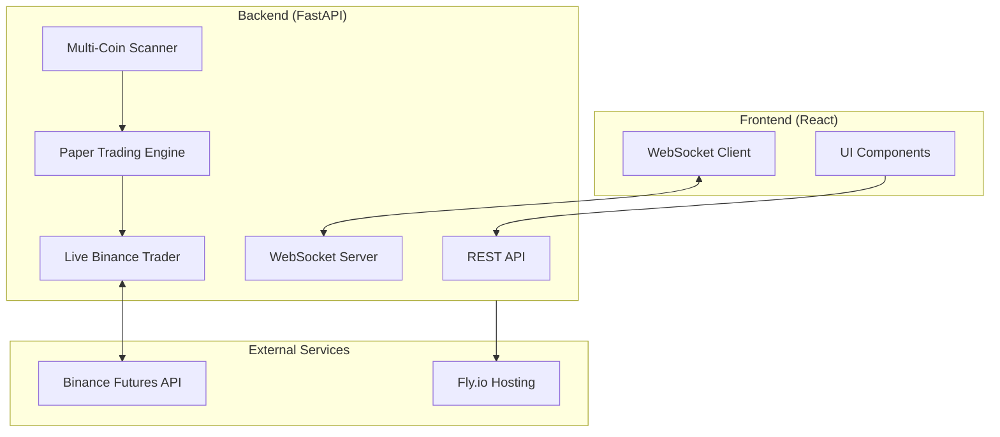
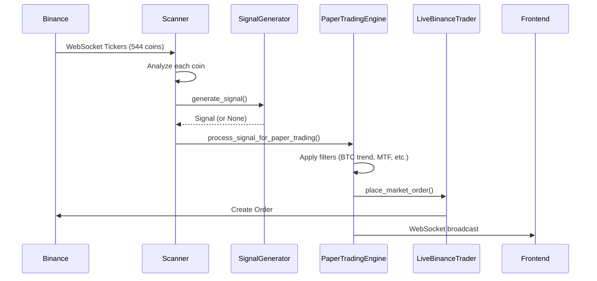
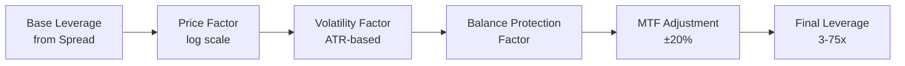
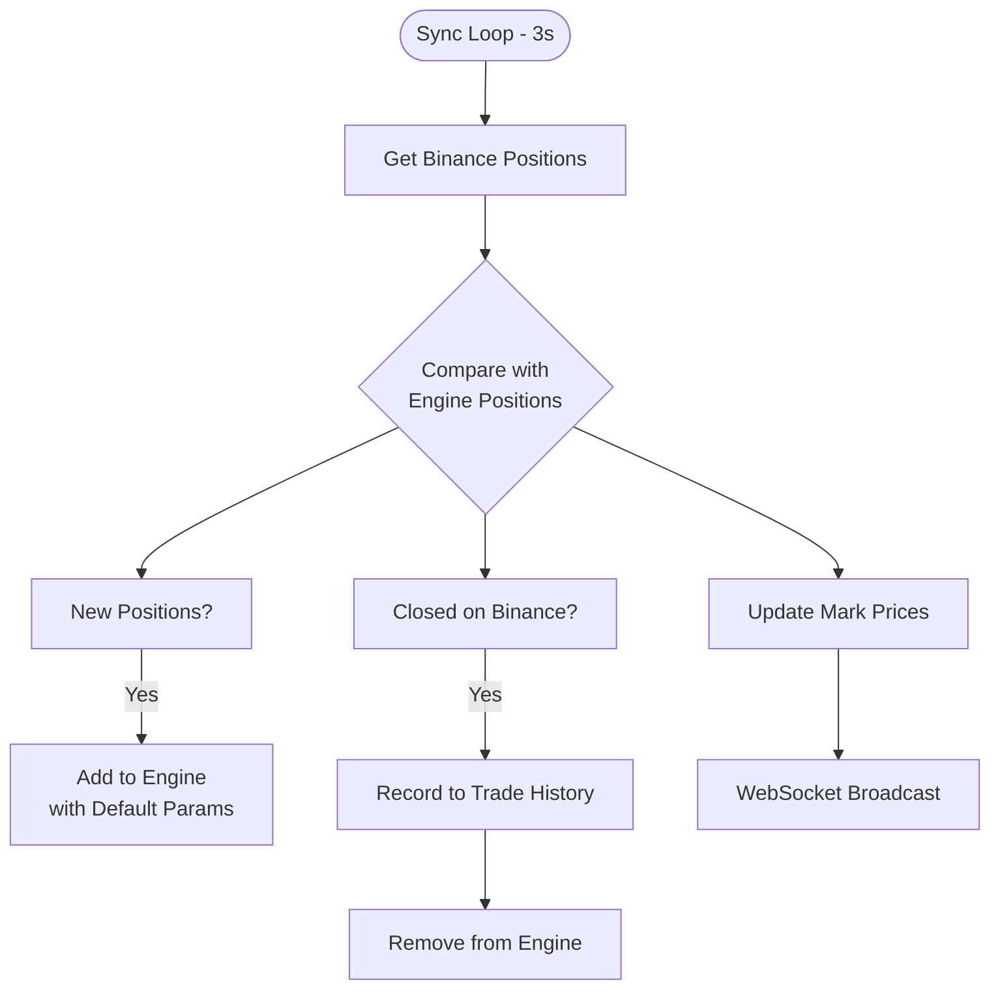
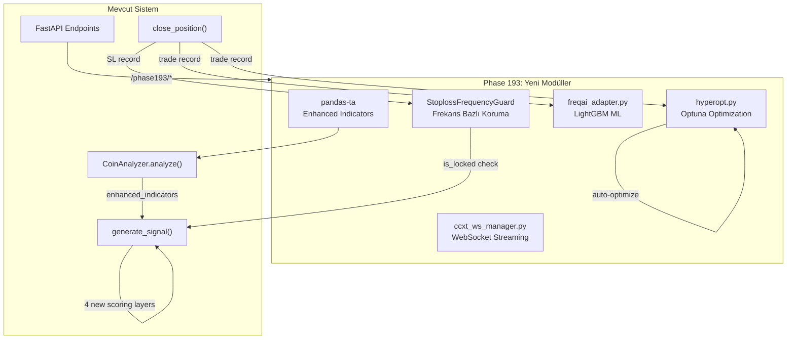
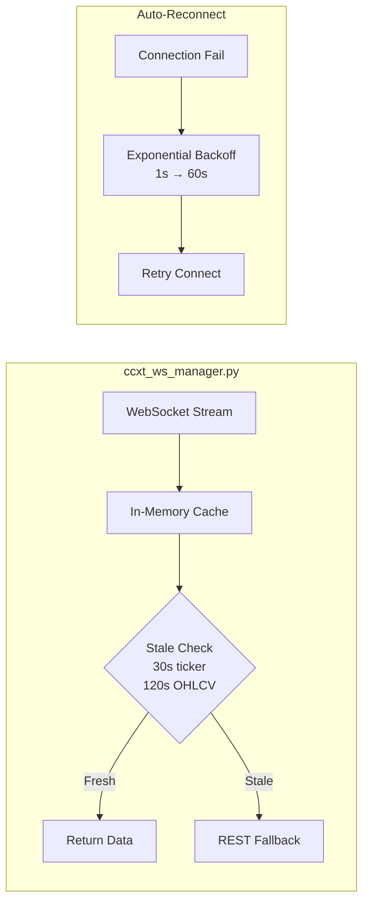
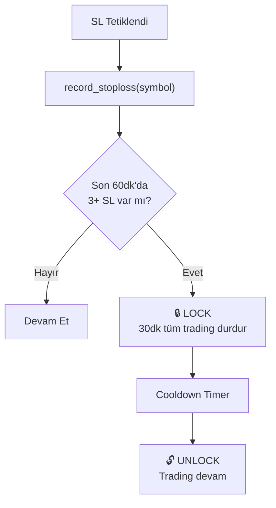
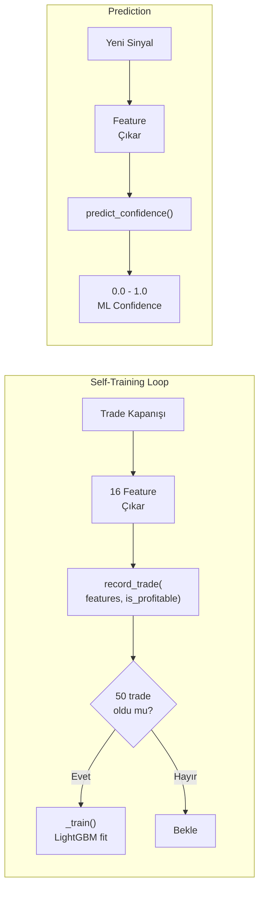
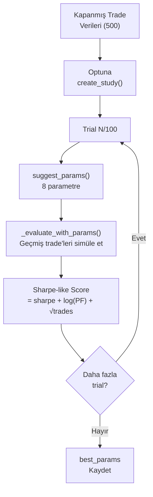

# HHQ-1 Quant Monitor - Developer Guide

> **ÖNEMLİ:** Bu dosya projenin ana referans dokümanıdır. Her geliştirme öncesi buraya bakılmalıdır.
> Son güncelleme: 2026-02-11

## 🔒 Stabil Rollback Noktası

| Tarih | Commit | Açıklama |
|-------|--------|----------|
| 2026-02-07 | `cee1faa` | Pre-refactor stabil — Backfill, SQLite logging, dynamic trail çalışıyor |
| 2026-02-04 | `081ed8f` | Phase 133 rollback sonrası stabil (Phase 135 öncesi) |
| 2026-02-04 | `7e4230d` | Phase 133 sonrası stabil versiyon (Hurst VETO, Trend VETO, Auto-Breakeven) |

**Rollback komutu:**
```bash
git checkout 7e4230d -- main.py
flyctl deploy --detach
```

---

## 📖 İçindekiler

1. [Proje Genel Bakış](#proje-genel-bakış)
2. [Mimari](#mimari)
3. [Algoritma Akışları](#algoritma-akışları)
4. [Kritik Dosyalar](#kritik-dosyalar)
5. [Öğrenilen Dersler](#öğrenilen-dersler)
6. [Sık Karşılaşılan Sorunlar](#sık-karşılaşılan-sorunlar)
7. [Deployment](#deployment)
8. [Geliştirme Geçmişi](#geliştirme-geçmişi)

---

## ⚠️ Önemli Notlar

> **AMS Makinesi:** Amsterdam (AMS) makinesi her zaman **STOPPED** durumunda kalmalıdır. Sadece Singapore (SIN) makinesi aktif olarak çalıştırılır.

---

## 🎯 Proje Genel Bakış

HHQ-1 Quant Monitor, 500+ kripto paritesinde gerçek zamanlı sinyal üretimi ve otomatik trading yapan bir platformdur.

### Temel Özellikler
- **Multi-Coin Scanner:** 544 coin'i eşzamanlı analiz eder
- **Sinyal Üretimi:** 13 katmanlı konfirmasyon sistemi
- **Live Trading:** Binance Futures entegrasyonu
- **Paper Trading:** Simülasyon modu
- **Risk Yönetimi:** Kill switch, balance protection, blacklist sistemi

### Teknoloji Stack
| Bileşen | Teknoloji |
|---------|-----------|
| Backend | Python, FastAPI, asyncio |
| Frontend | React, TypeScript, Vite |
| Exchange API | ccxt (Binance Futures) |
| Deployment | Fly.io |
| Real-time | WebSocket |

---

## 🏗️ Mimari



### Veri Akışı



---

## 🔄 Algoritma Akışları

### 1. Sinyal Üretimi (SignalGenerator)


### 2. Unified Leverage Hesaplaması (Phase 99)



**Formül:**
```
final_leverage = base_spread × price_factor × volatility_factor × balance_mult × mtf_mult
```

| Faktör | Açıklama | Değer Aralığı |
|--------|----------|---------------|
| base_spread | Spread seviyesine göre | 3-50x |
| price_factor | Log ölçekli fiyat | 0.3-1.0 |
| volatility_factor | ATR% bazlı | 0.3-1.0 |
| balance_mult | Drawdown koruması | 0.5-1.0 |
| mtf_mult | TF alignment bonus | 0.6-1.2 |

### 3. Pozisyon Yönetimi


### 4. Binance Senkronizasyonu



---

## 📁 Kritik Dosyalar

### Backend (main.py)
| Satır Aralığı | Bileşen | Açıklama |
|---------------|---------|----------|
| 608-740 | `get_positions()` | Binance pozisyon senkronizasyonu |
| 743-760 | `set_leverage()` | Leverage ayarı |
| 757-810 | `place_market_order()` | Order yerleştirme |
| 1120-1285 | Sync Loop | Binance senkronizasyon döngüsü |
| 2388-2422 | `CoinOpportunity` | Coin veri sınıfı |
| 3530-3578 | `analyze_all()` | Tüm coinleri analiz et |
| 4244-4600 | `process_signal_for_paper_trading()` | Sinyal işleme |
| 7982-8600 | `SignalGenerator` | Sinyal üretici sınıf |
| 8448-8530 | Unified Leverage | Birleşik leverage hesabı |
| 8582-9800 | `PaperTradingEngine` | Paper trading motoru |
| 10060-10130 | `close_position()` | Pozisyon kapatma |

### Frontend
| Dosya | Açıklama |
|-------|----------|
| `components/ActiveSignalsPanel.tsx` | Sinyal gösterimi |
| `components/PositionsTable.tsx` | Pozisyon tablosu |
| `hooks/useWebSocket.ts` | WebSocket bağlantısı |

---

## 📚 Öğrenilen Dersler

### 1. Leverage Tutarsızlığı (Phase 99)
**Problem:** UI'da gösterilen leverage ile Binance'e gönderilen leverage farklıydı.

**Sebep:** İki farklı yerde leverage hesaplanıyordu:
- `SignalGenerator` (UI için)
- `process_signal_for_paper_trading` (Binance için)

**Çözüm:** Tüm hesaplamayı `SignalGenerator`'da birleştirdik, `process_signal_for_paper_trading` sadece MTF bonus/penalty uyguluyor.

### 2. Trade History Kaybolması (Phase 100)
**Problem:** Binance'da harici olarak kapanan pozisyonlar trade history'de görünmüyordu.

**Sebep:** Sync döngüsü pozisyonları sadece siliyordu, trade history'e kaydetmiyordu.

**Çözüm:** Sync döngüsünde kapanan pozisyonları önce `trades` listesine ekle, sonra sil.

### 3. Paper vs Live Trading Tutarlılığı
**Bulgu:** Algoritma her iki modda da aynı. Tek fark `place_market_order()` çağrısı.

### 4. Timezone Farkı
**Dikkat:** Fly.io UTC timezone kullanıyor. Türkiye saati UTC+3.
- Log'da 18:30 görüyorsan, Türkiye'de 21:30.

### 5. Cross Margin Leverage Gösterimi
**Dikkat:** Binance cross margin'da `leverage` değeri her zaman 1x döner.
Gerçek leverage: `notional / margin` formülüyle hesaplanmalı.

---

### Sinyal Gelmiyor - Detaylı Troubleshooting

#### Adım 1: Log Akışını Kontrol Et

Fly.io Metrics'te şu sorguları çalıştır:

| Query | Log Çıkıyor mu? | Anlam |
|-------|-----------------|-------|
| `*Z_PASS*` | ✅ Evet | Z-Score threshold geçildi |
| `*PRE_SCORE*` | ✅ Evet | Skor hesaplaması tamamlandı |
| `*SCORE_PASS*` | ✅ Evet | Min skor aşıldı → Sinyal üretildi |
| `*SCORE_LOW*` | ⚠️ Evet | Skor yetersiz → Sinyal reddedildi |

#### Adım 2: Akış Noktalarını Belirle

```
Ticker → Z_PASS → Layer 1-15 → PRE_SCORE → SCORE Check → SCORE_PASS/LOW
         ↑                        ↑              ↑
         8522                    8791           8795
```

**Sorun Tanılama:**
- Z_PASS var, PRE_SCORE yok → **Layer 1-15 arasında exception veya return None**
- PRE_SCORE var, SCORE_PASS yok → **Min skor çok yüksek veya skor düşük**
- Hiç log yok → **Scanner çalışmıyor**

#### Adım 3: Yaygın Kök Nedenler

| Sorun | Belirti | Çözüm |
|-------|---------|-------|
| Tanımsız değişken | Z_PASS var, PRE_SCORE yok | `generate_signal` fonksiyonunda tanımsız değişken referansı kontrol et |
| Min skor çok yüksek | PRE_SCORE'da `score < min` | Settings'den min_score düşür (önerilen: 55-65) |
| Kill Switch Block | `BLOCKED` logu görünür | 24 saat bekle veya kill_switch_fault_tracker temizle |
| MTF VETO (-100) | Score negatif | BTC trend değişikliğini bekle |

#### Adım 4: Phase 137'de Bulunan Kritik Bug (Referans)

**Sorun:** Z_PASS logları çıkıyor ama PRE_SCORE asla görünmüyordu.

**Kök Neden:** `generate_signal` fonksiyonunda (line ~8760) tanımsız `opportunity` değişkeni kullanılıyordu:
```python
# HATALI KOD:
adx = getattr(opportunity, 'adx', 25.0) if opportunity else 25.0
# ↑ opportunity bu fonksiyona parametre olarak geçirilmiyordu!
```

Bu satır her çalıştığında **NameError** fırlatıyordu ve tüm exception'lar sessizce yutulduğu için sinyaller kayboluyordu.

**Çözüm:**
```python
# DÜZELTİLMİŞ KOD:
adx = 25.0  # Parametresi olmayan değişken yerine default değer
```

**Öğrenilen Ders:** Yeni layer eklerken:
1. Kullanılan tüm değişkenlerin fonksiyon scope'unda tanımlı olduğunu doğrula
2. Parametre listesinde yoksa ve global değilse → NameError olur
3. Test için `python3 -m py_compile main.py` yeterli değil, runtime error yakalanmaz

#### Adım 5: Debug Log Ekleme

Sinyal akışını takip etmek için trace log ekle:
```python
# Z_PASS sonrası, layer'ların başına:
logger.info(f"📍 LAYER_X: {symbol} score={score}")

# PRE_SCORE var ama sorun devam ediyorsa:
logger.info(f"📍 PRE_SCORE: {symbol} score={score} min={min_score_required} | reasons: {reasons}")
```


### Backend Yanıt Vermiyor
1. Makineyi restart et: `flyctl machine restart <ID> --app hhq-1-quant-monitor`
2. Logları kontrol et: `flyctl logs --app hhq-1-quant-monitor --no-tail`

### Pozisyon Mismatch
Binance'deki pozisyon sayısı ile Engine'deki farklıysa:
- Log: `⚠️ Position mismatch: Binance=X, Engine=Y`
- 3 saniye bekle, otomatik senkronize olur

### API Rate Limit
- Fast mode kullan: `get_positions(fast=True)`
- Sync interval: 3 saniye (2400 weight/min limitinin %60'ı)

---

## 🚀 Deployment

### Local Development
```bash
# Backend
cd /Users/ahmetdeveci/Downloads/hhq-1-quant-monitor
python3 main.py

# Frontend (ayrı terminal)
npm run dev
```

### Production Deploy
```bash
# Commit ve push
git add .
git commit -m "Description"
git push origin main

# Fly.io deploy
flyctl deploy --detach

# Status kontrol
flyctl status --app hhq-1-quant-monitor
flyctl logs --app hhq-1-quant-monitor --no-tail
```

### Rollback
```bash
# Son deployment'ı geri al
git revert HEAD --no-edit
git push origin main
flyctl deploy
```

---

## 📝 Geliştirme Geçmişi

| Tarih | Phase | Açıklama |
|-------|-------|----------|
| 2026-02-11 | 193 | Trading Kütüphane Entegrasyonları: pandas-ta, CCXT WS, StoplossGuard, FreqAI ML, Optuna Hyperopt |
| 2026-02-07 | 149 | Code Quality Refactor: safe_create_task, pending_close_reasons persist, WhaleDetector cleanup |
| 2026-02-06 | 148 | Binance Trade History Sync (5 min periodic) |
| 2026-02-06 | 147 | Live Position Trail Exit Execution |
| 2026-02-05 | 146 | Live Trailing State Persistence |
| 2026-02-05 | 145 | Live Position TP/SL/Trail Display |
| 2026-02-05 | 144 | ROI-Based Trail Activation (leverage + exit_tightness) |
| 2026-02-05 | 143 | Strong Trend Filter (4H 20 mum counter-trend penalty) |
| 2026-02-05 | 142 | Portfolio Recovery Trailing System |
| 2026-02-05 | 141 | Size vs Contracts Standardization |
| 2026-02-05 | 140 | Modular Architecture (backend/ package) |
| 2026-02-05 | 139 | Type Consistency (CloseReason types) |
| 2026-02-05 | 138 | Detailed Close Reasons with emojis |
| 2026-02-04 | 134 | Enhanced Scoring: RSI momentum, Volume spike, SMT divergence, VWAP, POC |
| 2026-02-04 | 133 | Signal Filtering: Auto-breakeven, Hurst VETO (>0.55), Trend VETO |
| 2026-02-02 | 99 | Unified Leverage: UI ve Binance için tek hesaplama |
| 2026-02-02 | 100 | Trade History Fix: Harici kapatmalar kaydediliyor |

---

## 📘 Phase 138-141 Detaylı Dokümantasyon

### Phase 138: Detailed Close Reasons (Emoji System)

**Amaç:** Trade kapanış nedenlerini daha okunabilir ve anlaşılır hale getirmek.

**Eski sistem:**
```python
reason = "SL_HIT"  # Kısa ve belirsiz
```

**Yeni sistem:**
```python
reason = "🔴 SL: Ana SL tetiklendi @ $0.5432 (-%2.5)"  # Emoji + detaylı bilgi
```

**Reason Kategorileri:**
| Kategori | Emoji | Örnekler |
|----------|-------|----------|
| Stop Loss | 🔴 🛑 | `🔴 SL: Ana SL tetiklendi` |
| Take Profit | 🟢 ✅ | `🟢 TP: TP1 seviyesi @ $price` |
| Trailing | 📈 | `📈 TRAIL: Trailing stop aktif` |
| Kill Switch | ⚠️ 🚨 | `⚠️ KILL: Margin kaybı ≥%30` |
| Time-Based | ⏰ ⏳ | `⏰ TIME: 4h kuralı (reduce)` |
| Recovery | 🔄 | `🔄 RECOVERY: Başabaşa dönüş` |
| Adverse | ⚡ | `⚡ ADVERSE: 8h+ zararda` |
| Manual | 👤 | `👤 MANUAL: Kullanıcı kapattı` |
| Emergency | 🚨 | `🚨 EMERGENCY: -%15 acil çıkış` |

---

### Phase 139: Type Consistency (TypeScript/Python Sync)

**Problem:** 
- `types.ts` sadece 8 CloseReason tanımlıyordu
- Backend 20+ farklı reason kullanıyordu
- UI'da bilinmeyen reason'lar gösterilmiyordu

**Çözüm:**

#### 1. `types.ts` Güncellemesi
```typescript
// Önceki (eksik):
closeReason: 'SL' | 'TP' | 'TRAILING' | 'MANUAL' | 'SIGNAL' | 'TP1' | 'SL1' | 'RESCUE';

// Yeni (kapsamlı):
export type CloseReason = 
  // Stop Loss variants
  | 'SL' | 'SL_HIT' | 'EMERGENCY_SL'
  // Take Profit variants  
  | 'TP' | 'TP_HIT' | 'TP1'
  // Trailing Stop
  | 'TRAILING' | 'TRAILING_STOP'
  // Kill Switch
  | 'KILL_SWITCH_FULL' | 'KILL_SWITCH_PARTIAL'
  // Time-based
  | 'TIME_GRADUAL' | 'TIME_FORCE' | 'TIME_REDUCE_4H' | 'TIME_REDUCE_8H'
  // Recovery & Adverse
  | 'RECOVERY_EXIT' | 'ADVERSE_TIME_EXIT'
  // External & Other
  | 'EXTERNAL' | 'MANUAL' | 'BREAKEVEN' | 'RESCUE' | 'END' | 'SIGNAL';
```

#### 2. Trade Interface Güncellemesi
```typescript
export interface Trade {
  // ... diğer alanlar
  reason?: string;            // Primary field (backend'den)
  closeReason?: CloseReason;  // Legacy compatibility
}
```

#### 3. `translateReason` Fonksiyonu (`App.tsx`)
```typescript
const translateReason = (reason: string | undefined): string => {
  // Phase 138 emoji reasons - already formatted
  if (reason?.includes('🔴 SL:') || reason?.includes('🟢 TP:')) {
    return reason;  // Pass through as-is
  }
  
  const mapping: Record<string, string> = {
    'SL': '🛑 SL: Trailing Stop Tetiklendi (3-tick onayı)',
    'TP': '✅ TP: Hedef Fiyata Ulaşıldı (R:R oranı)',
    'KILL_SWITCH_FULL': '🚨 KS Tam: Margin Kaybı ≥%50 → Tam Kapatma',
    'TIME_REDUCE_4H': '⏰ Zaman: 4 Saat Kuralı (-%10 azaltma)',
    // ... diğer mappings
  };
  
  return mapping[reason] || reason;
};
```

---

### Phase 140: Modular Architecture

**Problem:**
- `main.py` 13,449 satır monolithic kod
- Test, bakım ve geliştirme zorluğu
- Paralel çalışma imkansız

**Çözüm:** Backend'i modüler yapıya dönüştür

#### Yeni Dizin Yapısı
```
backend/
├── __init__.py
├── core/
│   ├── __init__.py
│   └── config.py              ⭐ Merkezi konfigürasyon
├── indicators/
│   ├── __init__.py
│   ├── atr.py                 ⭐ Average True Range
│   ├── hurst.py               ⭐ Hurst Exponent
│   ├── adx.py                 ⭐ ADX Trend Strength
│   ├── rsi.py                 ⭐ Relative Strength Index
│   └── zscore.py              ⭐ Z-Score Mean Reversion
└── trading/
    └── __init__.py            (gelecek için placeholder)
```

#### Config Kullanımı
```python
from backend.core.config import config

# Trading parameters
leverage = config.trading.default_leverage      # 10
max_positions = config.trading.max_positions    # 50
sl_multiplier = config.trading.sl_atr_multiplier  # 30.0

# Kill switch thresholds
first_reduction = config.kill_switch.first_reduction_pct  # -100%
full_close = config.kill_switch.full_close_pct            # -150%

# Scanner settings
scan_interval = config.scanner.scan_interval_seconds  # 3
excluded = config.scanner.excluded_coins  # ["USDCUSDT", ...]
```

#### Indicator Import
```python
from backend.indicators import (
    calculate_hurst,
    calculate_atr,
    calculate_adx,
    calculate_rsi,
    calculate_zscore
)

# Usage
hurst = calculate_hurst(prices)  # 0.15-0.85
atr = calculate_atr(highs, lows, closes)  # Volatility value
```

---

### Phase 141: Size vs Contracts Standardization

**Problem:**
- Binance API `contracts` döndürüyor
- İç kod `size` bekliyor
- Position close mismatch hataları

**Çözüm:** Her pozisyonda HEM `size` HEM `contracts` tut

#### 1. Binance Position Data (line ~724)
```python
# Eski:
result.append({
    'size': abs(contracts),
    # ...
})

# Yeni:
position_amount = abs(contracts)
result.append({
    'size': position_amount,        # İç kullanım
    'contracts': position_amount,   # Binance uyumlu
    # ...
})
```

#### 2. Sync Logic (lines 1214-1215)
```python
# Her iki field da sync ediliyor
position_size = bp.get('size', bp.get('contracts', pos.get('size')))
pos['size'] = position_size
pos['contracts'] = position_size
```

#### 3. Position Close İşlemleri
```python
# Fallback pattern
amount = pos.get('contracts', pos.get('size', 0))
```

#### 4. TypeScript Position Interface
```typescript
export interface Position {
  size: number;           // İç kullanım
  contracts?: number;     // Binance uyumlu (optional)
  // ...
}
```

---

### Phase 142: Portfolio Recovery Trailing

**Amaç:** Total Unrealized PnL 12+ saat ekside kalıp artıya dönerse, trailing ile tüm pozisyonları kapatarak bakiyeyi koru.

**Mantık:**
```
uPnL < 0 → 12+ saat → Recovery Candidate → uPnL > +$0.50 → Trailing aktif → Pullback > Trail → TÜM KAPAT
```

**PortfolioRecoveryManager Class (line ~6820):**
```python
class PortfolioRecoveryManager:
    # State
    underwater_start_time = None    # uPnL ekside ne zaman başladı
    is_recovery_candidate = False   # 12h+ underwater flag
    recovery_trailing_active = False
    peak_positive_pnl = 0.0
    trailing_distance_pct = 2.5     # Dynamic (BTC/ETH ATR)
    cooldown_until = None           # Kapatma sonrası bekleme
    
    # Config
    underwater_threshold_hours = 12  # 12 saat ekside kal
    min_positive_threshold = 0.50    # Min $0.50 artı
    min_trailing_pct = 1.5          # Min %1.5 trail
    max_trailing_pct = 5.0          # Max %5 trail
    cooldown_hours = 6              # 6 saat cooldown
```

**Trailing Distance Hesabı:**
```python
avg_atr = (BTC_ATR% + ETH_ATR%) / 2
distance = clamp(avg_atr, 1.5%, 5.0%)
```

**Entegrasyon Noktaları:**
| Dosya | Satır | Açıklama |
|-------|-------|----------|
| `main.py` | 1130-1165 | Sync loop'ta recovery check |
| `main.py` | 4595-4601 | Signal processing'de cooldown |
| `main.py` | 1105-1128 | `_get_coin_atr_percent()` helper |

**Log Pattern'leri:**
```
📊 RECOVERY TRACKING: uPnL negative, starting timer
⚠️ RECOVERY CANDIDATE: 12h+ underwater
🔄 RECOVERY ACTIVATED: Trailing started  
📈 RECOVERY PEAK: New peak recorded
🔴 RECOVERY TRIGGER: Closing all positions
⏸️ RECOVERY COOLDOWN: Blocking signals (Xh remaining)
```

---

## 📘 Phase 143: Strong Trend Filter

**Amaç:** 4H timeframe'de güçlü trend olan coinlere karşı açılan counter-trend sinyalleri cezalandırmak ve pozisyon boyutunu küçültmek.

**Problem:** HANAUSDT +400% yükselirken sistem SHORT açtı.

**Çözüm:** Son 20 4H mum kapanışından fiyat değişimi hesapla → Sinyal yönü ile karşılaştır → Kademeli penalty uygula:

| Fiyat Değişimi | Counter-Trend Penalty | Size Çarpanı |
|----------------|----------------------|--------------|
| <5% | 0 | 1.0x |
| 5-10% | -10 pts | 0.75x |
| 10-20% | -20 pts | 0.50x |
| >20% | -30 pts | 0.25x |

**Kod Yapısı:**
```python
# MTFScoringSystem class
def calculate_strong_trend_penalty(price_change_pct, signal_action) -> (penalty, size_mult)
# update_coin_trend() → price_change_4h_20 hesaplar
# confirm_signal() → penalty uygular
# open_position() → size_mult uygular
```

**Log Pattern'leri:**
```
⚠️ STRONG_TREND: +15.5% → SHORT penalized (-20, 50% size)
📊 STRONG_TREND: +7.2% → SHORT penalized (-10, 75% size)
📉 STRONG_TREND SIZE: 50% multiplier applied → size_mult=0.50
```

---

## 🔧 Yeni Geliştirme Kontrol Listesi

Yeni bir özellik eklerken:

- [ ] Bu dosyayı oku
- [ ] İlgili kod bölümlerini `main.py`'da bul
- [ ] Değişikliği yap
- [ ] `python3 -m py_compile main.py` ile syntax kontrolü
- [ ] Local test
- [ ] Git commit + push
- [ ] `flyctl deploy --detach`
- [ ] Logları kontrol et
- [ ] Bu dosyayı güncelle

---

> **Not:** Bu dosya her önemli geliştirmeden sonra güncellenmelidir.
> Son güncelleme: 2026-02-11 (Phase 193)

---

## Phase 155: AI Optimizer Yeniden Tasarım

### Değişiklik Özeti
AI Optimizer tamamen yeniden yazıldı. Eski AGGRESSIVE/DEFENSIVE mod sistemi kaldırılıp, PnL-korelasyon bazlı gradient optimizer getirildi.

### Yeni Mimari

1. **Trade Settings Snapshot** — Her pozisyon açılışında mevcut ayarlar (`entry_tightness`, `z_score_threshold`, `min_score_low`, `min_score_high`, `max_positions`) kaydedilir ve trade kaydına yazılır.

2. **PerformanceAnalyzer (PnL-Korelasyon)** — Her parametre için kârlı vs zararlı trade'lerin ortalama değerlerini karşılaştırır. PnL-ağırlıklı target hesaplar.

3. **ParameterOptimizer (Gradient-Bazlı)** — Target'a doğru her döngüde mesafenin %20'si kadar yaklaşır. Max step ve güvenlik limitleri ile kontrol edilir.

### Kaldırılan Dead Code
- `exit_tightness` — Optimizer'dan ve current_settings'ten kaldırıldı (hiçbir hesaplamada kullanılmıyordu)
- `sl_atr`, `tp_atr`, `trail_activation_atr`, `trail_distance_atr` — Optimizer kontrolünden çıkarıldı (dinamik volatilite bazlı hesaplanıyor)
- `kill_switch_first_reduction`, `kill_switch_full_close` — Optimizer'dan kaldırıldı (leverage bazlı dinamik hesaplanıyor)

### Düzeltilen Buglar
- **`applied.keys()` crash** — `apply_recommendations` artık dict döndürüyor (önce boolean döndürüyor, `.keys()` crash'e neden oluyordu)
- **Yanlış SL/TP limitleri** — SL/TP optimizer kontrolünden çıkarıldı (default 30 vs limit 1-4 uyumsuzluğu)
- **Ters `entry_tightness` mantığı** — AGGRESSIVE/DEFENSIVE mod kaldırılıp gradient sisteme geçildi

### Optimize Edilen Parametreler
| Parametre | Limit Min | Limit Max | Max Step |
|-----------|-----------|-----------|----------|
| `entry_tightness` | 0.5 | 4.0 | 0.2 |
| `z_score_threshold` | 0.8 | 2.5 | 0.1 |
| `min_score_low` | 30 | 60 | 3 |
| `min_score_high` | 60 | 95 | 3 |
| `max_positions` | 2 | 15 | 1 |

### SQLite Migration
- `trades` tablosuna `settings_snapshot TEXT DEFAULT "{}"` kolonu eklendi (auto-migration)

---

## Phase 156: Sinyal Kalitesi İyileştirme

### Rejim-Sinyal Veto Filtresi
- **Coin-level trend veto**: ADX > 30 VE Hurst > 0.55 → güçlü trend rejimi. Trend karşıtı mean-reversion sinyalleri otomatik olarak reddedilir.
- **VOLATILE rejim boost**: Makro piyasa VOLATILE rejimde iken, `min_score_required` %15 artırılır. Daha yüksek conviction gerekir.
- Yeni parametre: `market_regime` → `generate_signal()` (L10688)

### Layer 16: Order Book Imbalance Trend
- `LightweightCoinAnalyzer.imbalance_history` deque'u ile son ~100 tick'in bid/ask imbalance değerleri kaydedilir.
- `_get_imbalance_trend()`: Son 10 tick'in ortalaması vs önceki 20 tick → kısa vadeli alıcı/satıcı baskısı trendi.
- Aynı yönde trend → +5/+8 puan bonus, ters yönde → -5 penalty.
- Yeni parametre: `ob_imbalance_trend` → `generate_signal()`

---

## Phase 157: Funding Rate + Trade Pattern Analizi

### FundingOITracker
- Binance `premiumIndex` API'den tüm coinlerin funding rate'ini tek çağrıda çeker (5 dk cache)
- **Extreme funding** (>%0.08): kalabalıkla aynı yönde sinyal **VETOlanır** (FUNDING_VETO)
- **Yüksek funding** (>%0.03): contrarian bonus +8, crowd penalty -5
- **Normal funding** (>%0.01): hafif contrarian bonus +3
- Extreme contrarian squeeze: +10 bonus

### TradePatternAnalyzer
- Kapanmış trade'lerden öğrenme (1 saat cache, min 20 trade)
- **Coin WR**: düşük WR coin'e -5~-15 penalty, yüksek WR coin'e +5 bonus
- **Side WR**: LONG vs SHORT win rate karşılaştırması, zayıf tarafa -5 penalty
- **Score bins**: hangi skor aralığında daha çok kazanıyoruz analizi
- **Saat bazlı WR**: hangi saatlerde daha başarılıyız analizi

### Layer 17: Funding Rate Contrarian Scoring
- `generate_signal()` → `funding_rate` parametresi
- Funding extreme → veto, yüksek → ±8, normal → ±3

### Layer 18: Trade Pattern Penalty/Bonus
- `generate_signal()` → `coin_wr_penalty` parametresi
- Side penalty generate_signal içinde hesaplanır (`signal_side` orada bilinir)

### API Endpoint
- `GET /trade-analysis`: Trade pattern analizi + funding durumu

---

## Phase 193: Trading Kütüphane Entegrasyonları (2026-02-11)

> **Kapsamlı entegrasyon:** pandas-ta tabanlı indikatörler, CCXT Pro WebSocket, Freqtrade-ilhamlı risk yönetimi (StoplossGuard + FreqAI ML), Jesse-ilhamlı Optuna hyperopt.

### 📚 Referans Kaynaklar ve Kütüphaneler

Aşağıdaki kütüphaneler ve kaynaklar bu entegrasyonun temelini oluşturmuştur. İleride geri dönüp tekrar faydalanılabilir:

| Kütüphane | Kullanım Amacı | PyPI / GitHub |
|-----------|----------------|---------------|
| **pandas-ta** | 130+ teknik indikatör (MACD, BB, StochRSI, EMA, VWAP) | [GitHub: twopirllc/pandas-ta](https://github.com/twopirllc/pandas-ta) |
| **ccxt.pro** | WebSocket streaming ile gerçek zamanlı ticker/OHLCV | [GitHub: ccxt/ccxt](https://github.com/ccxt/ccxt) — [Pro Docs](https://docs.ccxt.com/#/ccxt.pro) |
| **Freqtrade** | StoplossGuard pattern, FreqAI ML framework | [GitHub: freqtrade/freqtrade](https://github.com/freqtrade/freqtrade) — [FreqAI Docs](https://www.freqtrade.io/en/stable/freqai/) |
| **Jesse** | Hyperparameter optimization yaklaşımı | [GitHub: jesse-ai/jesse](https://github.com/jesse-ai/jesse) — [Docs](https://docs.jesse.trade/) |
| **Optuna** | Bayesian hyperparameter optimization framework | [GitHub: optuna/optuna](https://github.com/optuna/optuna) — [PyPI](https://pypi.org/project/optuna/) |
| **LightGBM** | Gradient boosting ML framework (FreqAI modeli) | [GitHub: microsoft/LightGBM](https://github.com/microsoft/LightGBM) — [Docs](https://lightgbm.readthedocs.io/) |
| **scikit-learn** | ML pipeline (scaler, split, metrics) | [PyPI](https://pypi.org/project/scikit-learn/) |

**Freqtrade StoplossGuard kaynak kodu:**
- [freqtrade/plugins/protections/stoploss_guard.py](https://github.com/freqtrade/freqtrade/blob/develop/freqtrade/plugins/protections/stoploss_guard.py)
- Kullandığımız pattern: belirli sürede çok fazla SL tetiklenirse trading duraklat

**FreqAI konsept:**
- [FreqAI Introduction](https://www.freqtrade.io/en/stable/freqai/) — ML ile sinyal kalitesini tahmin etme
- Kullandığımız yaklaşım: Trade outcome'ları (kârlı/zararlı) ile feature'ları eşleştir, LightGBM ile öğren

**Jesse Hyperopt konsept:**
- [Jesse Optimization](https://docs.jesse.trade/docs/optimize/hyperparameters.html) — Trading parametrelerini geçmiş verilerle optimize et
- Kullandığımız yaklaşım: Optuna ile SL/TP/threshold parametrelerini Sharpe-like objective ile optimize et

### 🏗️ Mimari Genel Bakış



### Veri Akışı

```
Ticker → CoinAnalyzer.analyze()
           ↓
    calculate_enhanced_indicators() ← pandas-ta / manual fallback
           ↓
    generate_signal(enhanced_indicators=...)
           ↓
    ┌─ StoplossGuard.is_locked() → Reject if locked
    ├─ Layer 19: MACD Cross (+8)
    ├─ Layer 20: Bollinger Bands (+8)
    ├─ Layer 21: Stochastic RSI (+8)
    └─ Layer 22: EMA(8/21) Cross (+5)
           ↓
    Signal → Open Position → ... → close_position()
                                       ↓
                              ┌─ StoplossGuard.record_stoploss()
                              ├─ FreqAI.record_trade(features, outcome)
                              └─ Hyperopt.record_trade(trade_data)
                                       ↓
                              Auto-retrain (her 50 trade)
                              Auto-optimize (her 100 trade)
```

---

### Faz 1: pandas-ta İndikatör Zenginleştirme

#### Dosyalar ve Satır Referansları

| Dosya | Satır | Bileşen |
|-------|-------|---------|
| `main.py` | ~50 | `import pandas_ta as pta` (graceful fallback) |
| `main.py` | ~3258-3430 | `calculate_enhanced_indicators()` fonksiyonu |
| `main.py` | ~5108-5115 | `CoinAnalyzer.analyze()`'da çağrı noktası |
| `main.py` | ~12599 | `generate_signal()` imzasında `enhanced_indicators` parametresi |
| `main.py` | ~13020-13090 | Layer 19-22 scoring katmanları |

#### `calculate_enhanced_indicators()` Fonksiyonu

```python
def calculate_enhanced_indicators(highs, lows, closes, volumes=None) -> dict:
    """
    Returns:
        macd_histogram     : MACD histogram (positive=bullish)
        macd_signal_cross  : 'BULLISH' / 'BEARISH' / 'NEUTRAL'
        bb_position        : -1 to +1 (>1 = above upper band)
        bb_width           : Band width % (volatility measure)
        stoch_rsi_k        : 0-100 (<20=oversold, >80=overbought)
        stoch_rsi_d        : Smoothed StochRSI
        stoch_rsi_cross    : 'BULLISH' / 'BEARISH' / 'NEUTRAL'
        ema_8, ema_21      : EMA values
        ema_cross          : 'BULLISH' / 'BEARISH' / 'NEUTRAL'
        vwap_value         : VWAP (if volumes available)
    """
```

**Çift mod:** pandas-ta mevcutsa tam hesaplama, yoksa numpy/pandas ile basitleştirilmiş manual hesaplama. Fallback her zaman çalışır.

#### 4 Yeni Scoring Katmanı

| Layer | İndikatör | Max Bonus | Koşul | Mantık |
|-------|-----------|-----------|-------|--------|
| 19 | MACD Cross | +8 | MACD crossover sinyal yönünü onaylıyor | `macd_signal_cross == signal_side` |
| 20 | Bollinger Bands | +8 | Fiyat BB ekstremlerinde | `bb_position < -0.8` (LONG) veya `> 0.8` (SHORT) |
| 21 | Stochastic RSI | +8 | StochRSI crossover aşırı bölgede | `stoch_rsi_k < 20` (LONG) veya `> 80` (SHORT) |
| 22 | EMA(8/21) Cross | +5 | Kısa vadeli trend onayı | `ema_cross == 'BULLISH'` (LONG) veya `'BEARISH'` (SHORT) |

> **Önemli:** Tüm yeni katmanlar **sadece bonus** verir, veto **uygulamaz**. Mevcut sinyal mantığını kırmamak için tasarlanmıştır.

#### pandas-ta Kullanım Örnekleri (İleride Referans İçin)

```python
import pandas_ta as pta

# DataFrame oluştur
df = pd.DataFrame({'high': highs, 'low': lows, 'close': closes, 'volume': volumes})

# MACD
macd = df.ta.macd(fast=12, slow=26, signal=9)
# Sütunlar: MACD_12_26_9, MACDh_12_26_9, MACDs_12_26_9

# Bollinger Bands
bb = df.ta.bbands(length=20, std=2)
# Sütunlar: BBL_20_2.0, BBM_20_2.0, BBU_20_2.0, BBB_20_2.0, BBP_20_2.0

# Stochastic RSI
stoch = df.ta.stochrsi(length=14, rsi_length=14, k=3, d=3)
# Sütunlar: STOCHRSIk_14_14_3_3, STOCHRSId_14_14_3_3

# EMA
ema8 = df.ta.ema(length=8)
ema21 = df.ta.ema(length=21)

# VWAP
vwap = df.ta.vwap()

# ATR (EMA smoothed — daha doğru)
atr = df.ta.atr(length=14)

# Tüm indikatörleri tek seferde
df.ta.strategy("All")  # 130+ indikatör
```

---

### Faz 2: CCXT Pro WebSocket Manager

#### Dosya: `ccxt_ws_manager.py`

| Bileşen | Açıklama |
|---------|----------|
| `CCXTWebSocketManager` class | Ana WebSocket yönetici sınıfı |
| `watch_tickers()` | Ticker stream (real-time fiyat) |
| `watch_ohlcv()` | OHLCV stream (mum verileri) |
| `get_ticker()` | Cache'den ticker çek |
| `get_ohlcv()` | Cache'den OHLCV çek |
| `get_status()` | Sağlık durumu raporu |

#### Mimari



#### Konfigürasyon

```python
ccxt_ws_manager = CCXTWebSocketManager(
    exchange_id='binanceusdm',     # Binance Futures
    api_key=os.environ.get('BINANCE_API_KEY'),
    api_secret=os.environ.get('BINANCE_API_SECRET'),
    max_reconnect_delay=60,        # Max backoff süresi
    ticker_staleness_seconds=30,   # Ticker cache süresi
    ohlcv_staleness_seconds=120,   # OHLCV cache süresi
)
```

#### ccxt.pro Referans (İleride Kullanım İçin)

```python
import ccxt.pro as ccxtpro

# WebSocket exchange oluştur
exchange = ccxtpro.binanceusdm({
    'apiKey': '...',
    'secret': '...',
    'options': {'defaultType': 'future'},
})

# Ticker stream
ticker = await exchange.watch_ticker('BTC/USDT')
# Returns: {'last': 45000, 'bid': 44999, 'ask': 45001, 'volume': ...}

# OHLCV stream
ohlcv = await exchange.watch_ohlcv('BTC/USDT', '5m')
# Returns: [[timestamp, open, high, low, close, volume], ...]

# Multi-symbol ticker
tickers = await exchange.watch_tickers(['BTC/USDT', 'ETH/USDT'])

# Bağlantı kapat
await exchange.close()
```

---

### Faz 3: Freqtrade Risk Yönetimi + FreqAI

#### A) StoplossFrequencyGuard (`main.py` ~L9460-9610)

Freqtrade'in `StoplossGuard` plugin pattern'inden esinlenilmiştir.

**Konsept:** Kill Switch margin bazlı (büyük tek kayıp), StoplossGuard frekans bazlı (art arda küçük kayıplar). İkisi **tamamlayıcı** koruma katmanları.



**Sınıf yapısı:**
```python
class StoplossFrequencyGuard:
    lookback_minutes: int = 60       # Son 60 dakika
    max_stoplosses: int = 3          # Max 3 SL
    cooldown_minutes: int = 30       # 30 dk duraklat
    only_per_pair: bool = False      # False=global, True=coin-bazlı
    enabled: bool = True

    def record_stoploss(symbol, reason)   # SL olayını kaydet
    def is_locked(symbol) -> bool         # Trading bloke mu?
    def get_lock_reason(symbol) -> str    # Neden bloke?
    def get_status() -> dict              # Durum raporu
    def update_settings(data: dict)       # Ayarları güncelle
```

**Entegrasyon noktaları:**

| Nokta | Dosya:Satır | Açıklama |
|-------|-------------|----------|
| Sinyal kontrolü | `main.py:~13098` | `generate_signal()` başında `is_locked()` check |
| SL kaydı | `main.py:~15310` | `close_position()` sonrası `record_stoploss()` |
| API | `main.py:~17000` | `POST /phase193/stoploss-guard/settings` |

**Konfigürasyon API:**
```bash
curl -X POST https://hhq-1-quant-monitor.fly.dev/phase193/stoploss-guard/settings \
  -H "Content-Type: application/json" \
  -d '{"lookback_minutes": 45, "max_stoplosses": 5, "cooldown_minutes": 20}'
```

#### B) FreqAI Adapter (`freqai_adapter.py`)

LightGBM binary classifier — trade outcome'larından öğrenen ML modeli.

**Konsept:** Her trade kapanışında sinyal anındaki feature'ları + sonucu kaydet → Yeterli veri toplandığında (30+ trade) model eğit → Yeni sinyallerde ML confidence skoru üret.



**16 ML Feature:**
```python
FEATURE_NAMES = [
    'zscore',          # Z-Score değeri
    'hurst',           # Hurst exponent (0-1)
    'rsi',             # RSI (0-100)
    'adx',             # ADX trend gücü
    'volume_ratio',    # Volume / avg_volume
    'bb_position',     # Bollinger Band pozisyonu (-1 to +1)
    'macd_histogram',  # MACD histogram
    'stoch_rsi_k',     # Stochastic RSI %K
    'ema_cross_bullish', # EMA crossover (0/1)
    'vwap_zscore',     # VWAP z-score
    'spread_pct',      # Spread yüzdesi
    'funding_rate',    # Funding rate
    'imbalance',       # Order book imbalance
    'signal_score',    # Toplam sinyal skoru
    'leverage',        # Uygulanan leverage
    'atr_pct',         # ATR / Price yüzdesi
]
```

**Model Detayları:**
- **Algoritma:** LightGBM (gradient boosting) — hızlı, düşük bellek, yüksek accuracy
- **Fallback:** LightGBM yoksa scikit-learn RandomForest
- **Eğitim:** Chronological 80/20 split (look-ahead bias'ı önler)
- **Metrikler:** Accuracy, F1-Score, Feature Importance (gain-based)
- **Persistence:** Training data `./data/freqai_training_data.json`'a kaydedilir (son 1000 trade)
- **Auto-retrain:** Her 50 trade'de otomatik yeniden eğitim

**LightGBM Parametreleri:**
```python
params = {
    'objective': 'binary',       # İkili sınıflandırma
    'metric': 'binary_logloss',  # Log loss minimize
    'boosting_type': 'gbdt',     # Gradient boosted trees
    'num_leaves': 31,            # Tree karmaşıklığı
    'learning_rate': 0.05,       # Öğrenme hızı
    'feature_fraction': 0.8,     # Feature alt-örnekleme
    'bagging_fraction': 0.8,     # Data alt-örnekleme
    'bagging_freq': 5,           # Her 5 iterasyonda bag
    'n_jobs': 1,                 # Tek thread (Fly.io)
}
# Early stopping: 10 round iyileşme yoksa dur
```

---

### Faz 4: Jesse-İlhamlı Optuna Hyperopt

#### Dosya: `hyperopt.py`

**Konsept:** Geçmiş trade verilerini kullanarak optimal SL/TP ATR çarpanları, z-score eşikleri ve diğer parametreleri Bayesian optimization ile bul.



**Optimize Edilen 8 Parametre:**

| Parametre | Açıklama | Min | Max | Default |
|-----------|----------|-----|-----|---------|
| `sl_atr` | Stop-loss ATR çarpanı | 1.0 | 5.0 | 2.0 |
| `tp_atr` | Take-profit ATR çarpanı | 1.5 | 6.0 | 3.0 |
| `exit_tightness` | Çıkış sıkılık faktörü | 0.5 | 2.0 | 1.2 |
| `entry_tightness` | Giriş sıkılık faktörü | 0.5 | 2.0 | 1.8 |
| `z_score_threshold` | Z-Score giriş eşiği | 0.8 | 3.0 | 1.6 |
| `min_confidence` | Minimum sinyal skoru | 50 | 95 | 68 |
| `trail_activation` | Trailing stop aktivasyon ATR | 0.5 | 3.0 | 1.5 |
| `trail_distance` | Trailing stop mesafe ATR | 0.3 | 2.0 | 1.0 |

**Objective Fonksiyonu:**
```python
# Sharpe-like ratio + Profit factor bonus + Trade count bonus
score = (mean_pnl / std_pnl * sqrt(N)) + log(1 + profit_factor) + sqrt(N) * 0.1
```
- Sharpe-like: Risk-adjusted return
- Profit factor: Toplam kazanç / toplam kayıp
- Trade count: Çok az trade alıyorsa cezalandır (< 10 trade = -100)

**Auto-Optimize:**
- Her 100 trade kapanışında otomatik tetiklenir
- 100 Optuna trial çalıştırır
- En iyi parametreleri `./data/hyperopt_best_params.json`'a kaydeder
- Default parametrelerle karşılaştırma yapar ve iyileşme yüzdesini loglar

**Optuna Kullanım Referansı (İleride İçin):**
```python
import optuna

# Study oluştur
study = optuna.create_study(direction='maximize')

# Default parametreleri ilk trial olarak ekle
study.enqueue_trial({'param1': 1.0, 'param2': 2.0})

# Optimize et
study.optimize(objective_function, n_trials=100)

# Sonuçlar
print(study.best_trial.params)   # En iyi parametreler
print(study.best_trial.value)    # En iyi skor
print(study.trials_dataframe())  # Tüm trial'lar

# Görselleştirme (local dev için)
from optuna.visualization import plot_optimization_history, plot_param_importances
plot_optimization_history(study)
plot_param_importances(study)
```

---

### 🔌 Yeni API Endpointleri

| Method | Path | Açıklama | Örnek |
|--------|------|----------|-------|
| GET | `/phase193/status` | Tüm modül durumları | `curl .../phase193/status` |
| POST | `/phase193/stoploss-guard/settings` | SL guard ayarlarını güncelle | Body: `{"max_stoplosses": 5}` |
| POST | `/phase193/freqai/retrain` | ML modelini zorla eğit | Body yok |
| POST | `/phase193/hyperopt/run` | Optimizasyon başlat | Body: `{"n_trials": 200}` |

**Örnek `/phase193/status` yanıtı:**
```json
{
  "stoploss_guard": {"enabled": true, "global_locked": false, "recent_stoplosses": 0},
  "freqai": {"enabled": true, "is_trained": false, "sklearn_available": true, "lightgbm_available": true},
  "hyperopt": {"enabled": true, "optuna_available": true, "is_optimized": false},
  "ws_manager": {"ccxt_pro_available": true, "connected": false},
  "pandas_ta": false
}
```

---

### 🔗 Post-Close Hook Entegrasyonu

Trade kapandığında 3 modüle otomatik bildirim yapılır (`main.py:~15305-15346`):

```python
# close_position() sonrası:
try:
    # 1. SL guard — SL nedenli kapanışları kaydet
    if 'SL' in reason.upper() or 'STOP' in reason.upper():
        stoploss_frequency_guard.record_stoploss(symbol, reason)

    # 2. FreqAI — ML eğitimi için trade feature'larını kaydet
    if freqai_model and freqai_model.enabled:
        freqai_model.record_trade(ml_features, pnl > 0)

    # 3. Hyperopt — Parametre optimizasyonu için trade verisi kaydet
    if hhq_hyperoptimizer and hhq_hyperoptimizer.enabled:
        hhq_hyperoptimizer.record_trade(trade)
        if hhq_hyperoptimizer.should_auto_optimize():
            asyncio.create_task(hhq_hyperoptimizer.optimize())
except Exception as e:
    logger.warning(f"⚠️ Phase 193 post-close hook error: {e}")
```

---

### 📦 Bağımlılık Değişiklikleri

**requirements.txt:**
```diff
+scikit-learn>=1.3.0
+lightgbm>=4.0.0
+optuna>=3.4.0
```

**Dockerfile:**
```diff
-FROM python:3.9-slim
+FROM python:3.11-slim
 RUN apt-get update && apt-get install -y \
     gcc \
+    g++ \
     && rm -rf /var/lib/apt/lists/*
+RUN pip install --no-cache-dir pandas_ta || echo "pandas-ta fallback"
```

> **Not:** `pandas-ta` PyPI'de sürüm belirtilerek kurulamıyor, bu yüzden Dockerfile'da ayrı `pip install pandas_ta` ile kurulur. Başarısız olursa manual fallback hesaplamaları devreye girer.

---

### 🐛 Deploy Sırasında Bulunan ve Düzeltilen Hatalar

| # | Hata | Kritiklik | Açıklama | Düzeltme |
|---|------|-----------|----------|----------|
| 1 | `import time` eksik | 🔴 CRASH | `StoplossFrequencyGuard` `time.time()` kullanıyor ama `import time` top-level'da yoktu | `import time` satır 21'e eklendi |
| 2 | `FakeTrial` mock | 🟠 CRASH | Hyperopt default score karşılaştırmasında `type('FakeTrial')` mock kırılgandı | `_evaluate_with_params()` metodu ile refactor edildi |
| 3 | `pandas-ta` PyPI'de yok | 🔴 BUILD FAIL | `pandas-ta>=0.3.14b1` pip'te bulunamıyor | requirements.txt'ten kaldırılıp Dockerfile'da ayrı install yapıldı |
| 4 | `logger` tanımdan önce kullanım | 🔴 CRASH | pandas-ta import bloğu `logger.warning()` çağırıyordu ama `logger` henüz tanımlı değildi | Import sırası düzeltildi: önce logger, sonra pandas-ta |
| 5 | Python 3.9 uyumsuzluk | 🔴 BUILD FAIL | lightgbm, optuna ve pandas-ta Python 3.10+ gerektiriyor | Dockerfile `python:3.9-slim` → `python:3.11-slim` |

**Öğrenilen Dersler:**
1. **Import sırası kritik:** Logger tanımlanmadan önce logger kullanan kod çalışmaz. `try/except ImportError` bloklarında bile!
2. **PyPI kullanılabilirliği varsayılamaz:** Bazı paketler PyPI'de eski/kaldırılmış olabilir. Docker build'de test edilmeli.
3. **Mock pattern'ler kırılgan:** `type()` ile dynamic class oluşturmak yerine, core logic'i ayrı metoda çıkar ve doğrudan çağır.
4. **Python alt sürüm uyumluluğu:** ML kütüphaneleri genellikle Python 3.10+ ister. Docker base image güncel tutulmalı.
5. **Graceful fallback her yerde:** Her yeni modül import'u `try/except` ile sarmalı, yoksa tek bir eksik paket tüm uygulamayı çökertir.

---

### 📝 Log Pattern'leri

```
# pandas-ta
✅ pandas-ta loaded successfully
⚠️ pandas-ta not installed, using manual TA calculations

# StoplossFrequencyGuard
🛑 SL_GUARD: BTCUSDT LONG rejected — Global lock: 3 SLs in 60min
🔒 SL_GUARD: Global lock activated (3 SLs in 60min, cooldown 30min)
🔓 SL_GUARD: Global lock expired

# FreqAI
✅ FreqAI trained (#3): accuracy=67.50%, f1=65.20%, samples=150
FreqAI: Trade recorded (profitable=True, total=51, until_retrain=49)

# Hyperopt
🔬 Hyperopt starting: 100 trials, 200 trades
✅ Hyperopt complete: score=2.3456 (default=1.8901, improvement=+24.1%)

# Module imports
✅ ccxt_ws_manager loaded
✅ freqai_adapter loaded
✅ hyperopt loaded
⚠️ Phase 193 post-close hook error: ...
```

---

### 🔮 Gelecek İyileştirmeler (TODO)

- [ ] FreqAI confidence score'u `generate_signal()` scoring'e entegre et (Layer 23)
- [ ] Hyperopt'un bulduğu best_params'ı otomatik olarak paper trader settings'e uygula
- [ ] ccxt_ws_manager'ı ana scanner loop'a entegre et (REST polling → WS streaming)
- [ ] pandas-ta Docker build'de çalışır hale getir (GitHub'dan pip install)
- [ ] UI'da Phase 193 modül durumlarını göster (Settings panel)
- [ ] StoplossGuard per-pair mode'u test et ve UI toggle ekle

